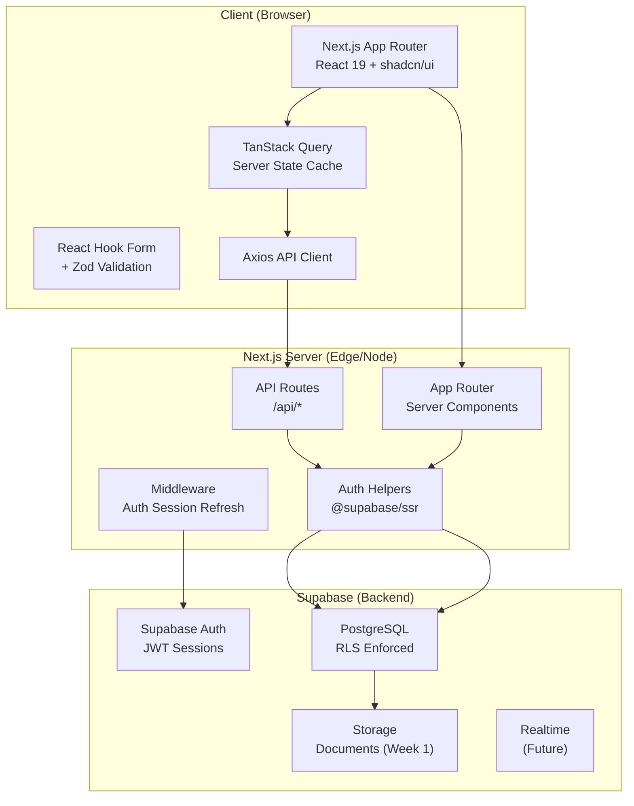
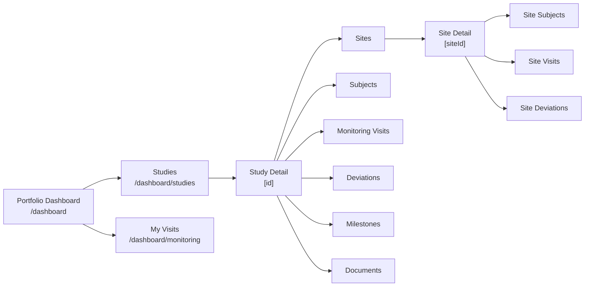
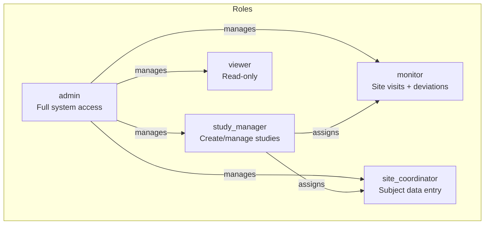
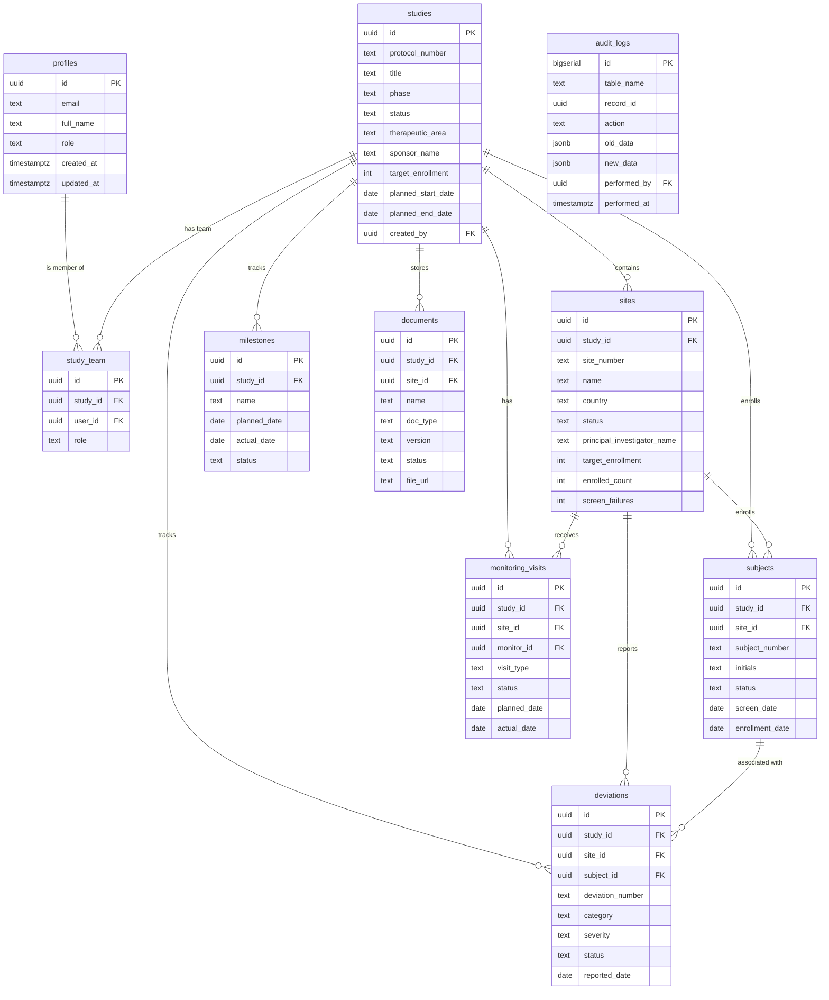
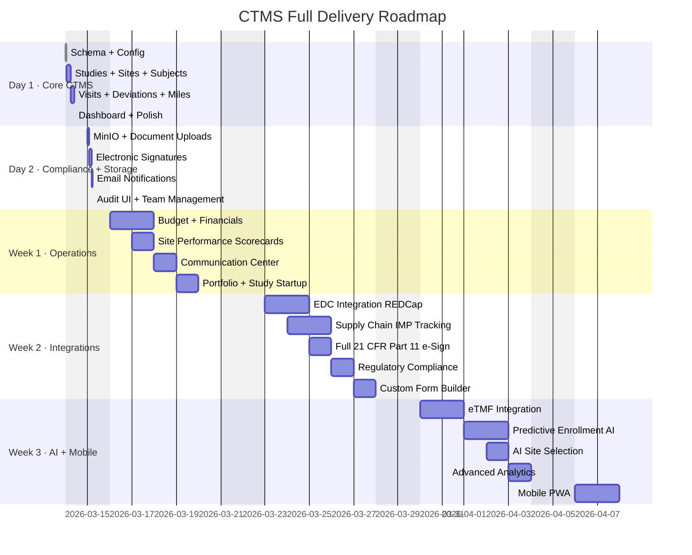

# NextGen CTMS — Clinical Trial Management System

A modern, open-source Clinical Trial Management System built on **Next.js 16 + Supabase**, designed to rival Veeva Vault CTMS for mid-market biotech and pharmaceutical companies.

---

## Tech Stack

| Layer | Technology |
|---|---|
| Framework | Next.js 16.1.6 (App Router) |
| Language | TypeScript 5 |
| Database | PostgreSQL via Supabase |
| Auth | Supabase Auth (email/password) |
| ORM / Query | Supabase JS client + TanStack Query v5 |
| UI Components | shadcn/ui + Tailwind CSS v4 |
| Forms | React Hook Form + Zod |
| Tables | TanStack Table v8 |
| HTTP Client | Axios |
| Icons | Lucide React |
| Toasts | Sonner |
| Date Utils | date-fns |

---

## System Architecture



---

## Application Modules



---

## User Roles & Access



| Role | Studies | Sites | Subjects | Monitoring Visits | Deviations | Admin |
|---|---|---|---|---|---|---|
| `admin` | Full CRUD | Full CRUD | Full CRUD | Full CRUD | Full CRUD | Yes |
| `study_manager` | Create + manage assigned | Full CRUD | Full CRUD | Full CRUD | Full CRUD | No |
| `monitor` | View assigned | View assigned | View assigned | Create + complete | Create + resolve | No |
| `site_coordinator` | View assigned | View own site | Create + update | View | Create | No |
| `viewer` | View assigned | View assigned | View assigned | View | View | No |

---

## Database Schema Overview



---

## Getting Started

### Prerequisites

- Node.js 18+
- Docker + Docker Compose (for MinIO local object storage)
- A Supabase project ([supabase.com](https://supabase.com))

### Setup

```bash
# 1. Clone and install
git clone <repo>
cd NextJS-Supabase
npm install

# 2. Configure environment
cp .env.example .env.local
# Fill in your Supabase URL, anon key, and MinIO credentials (defaults pre-filled)

# 3. Start MinIO (S3-compatible object storage for document uploads)
docker compose up -d
# MinIO S3 API  → http://localhost:9000
# MinIO Console → http://localhost:9001  (minioadmin / minioadmin123)
# Buckets auto-created: ctms-documents, ctms-signatures

# 4. Run the database migrations (Supabase CLI)
npx supabase login
npx supabase init
npx supabase link --project-ref btyegkygtvotuaxjjzgl
npx supabase db push

# 5. Start the dev server
npm run dev
```

### Local Runtime Contract (for all agents)

- The app is expected to run on `http://localhost:3000`.
- For each sprint/API change, the agent must test every created/updated API route before handoff:
  - unauthenticated access behavior (`401`/`403`)
  - authenticated success path
  - validation/error path
  - DB side effects and RLS behavior where relevant
- Do not mark a sprint complete without API verification evidence.

### Environment Variables

```env
# Supabase
NEXT_PUBLIC_SUPABASE_URL=https://your-project.supabase.co
NEXT_PUBLIC_SUPABASE_ANON_KEY=your-anon-key

# MinIO (local dev defaults — matches docker-compose.yml)
S3_ENDPOINT=http://localhost:9000
S3_ACCESS_KEY_ID=minioadmin
S3_SECRET_ACCESS_KEY=minioadmin123
S3_BUCKET_NAME=ctms-documents
S3_SIGNATURES_BUCKET_NAME=ctms-signatures
S3_REGION=us-east-1
NEXT_PUBLIC_S3_PUBLIC_URL=http://localhost:9000/ctms-documents

# Email (Sprint 11+)
RESEND_API_KEY=re_xxxxxxxxxxxxxxxxxxxx
EMAIL_FROM=noreply@yourctms.com

# AI features (Sprint 23+)
ANTHROPIC_API_KEY=sk-ant-xxxxxxxxxxxx
```

### MinIO Object Storage

MinIO is an S3-compatible object storage server used locally for document uploads. In production, swap it for AWS S3, Cloudflare R2, or any S3-compatible service — only the env vars change, no code changes required.

```bash
# Start MinIO
docker compose up -d

# Stop MinIO
docker compose down

# View MinIO logs
docker compose logs -f minio

# Access MinIO web console
open http://localhost:9001
# Login: minioadmin / minioadmin123
```

**Buckets created automatically on first start:**
- `ctms-documents` — protocol PDFs, ICFs, monitoring reports, regulatory docs
- `ctms-signatures` — electronic signature artifacts

---

## Project Structure

```
src/
├── app/
│   ├── auth/                    # Sign in, sign up, callback
│   ├── dashboard/
│   │   ├── page.tsx             # Portfolio dashboard
│   │   ├── studies/             # Studies module
│   │   │   ├── page.tsx
│   │   │   ├── new/
│   │   │   └── [id]/
│   │   │       ├── page.tsx     # Study detail hub (tabbed)
│   │   │       ├── edit/
│   │   │       ├── sites/
│   │   │       ├── subjects/
│   │   │       ├── monitoring/
│   │   │       ├── deviations/
│   │   │       └── milestones/
│   │   └── monitoring/          # Monitor's visit queue
│   ├── admin/                   # User management
│   └── api/                     # API route handlers
│       ├── studies/
│       ├── sites/
│       ├── subjects/
│       ├── monitoring-visits/
│       ├── deviations/
│       ├── milestones/
│       └── documents/
├── components/
│   ├── ui/                      # shadcn primitives
│   ├── layout/                  # Sidebar, breadcrumbs, shell
│   ├── shared/                  # DataGrid, theme
│   ├── common/                  # RoleGuard, dialogs
│   └── ctms/                    # CTMS-specific components
│       ├── studies/
│       ├── sites/
│       ├── subjects/
│       ├── monitoring/
│       └── deviations/
├── hooks/                       # TanStack Query hooks
├── lib/                         # Supabase clients, utilities
├── types/                       # Database types, Zod schemas
└── constants/                   # Routes, roles, query keys
```

---

## Compliance Notes

This system is designed with GCP and 21 CFR Part 11 awareness:

- **Audit Trail**: All mutations on clinical data write to `audit_logs` (table, record ID, action, old/new data, user, timestamp)
- **Subject Pseudonymization**: No patient names or DOB stored — subject number + initials only
- **RLS Everywhere**: Every table has Row Level Security enabled; study access is gated by `study_team` membership
- **Role-Based Access**: Granular RBAC enforced at both API route and UI levels
- **Electronic Signatures**: Not implemented in MVP — deferred to Week 1 (see `planning/sprints.md`)

---

## Documentation

| File | Contents |
|---|---|
| `planning/ctms-blueprint.md` | Full functional + technical specification |
| `planning/sprints.md` | Day 1 build plan, sprint breakdown, AI prompts |
| `docs/database.md` | Schema reference, RLS policies, conventions |
| `docs/api-contracts.md` | API endpoint contracts (request/response shapes) |
| `planning/features.md` | Feature status tracker |

---

## Roadmap

All features are planned and will be delivered. See `planning/sprints.md` for full sprint details.


