# CTMS Blueprint — Full Technical & Functional Specification

> Reference document for the NextGen Clinical Trial Management System.
> Stack: Next.js 16 · Supabase · TanStack Query · shadcn/ui · Zod · React Hook Form

---

## Table of Contents

1. [Executive Summary](#executive-summary)
2. [User Roles & Permissions](#user-roles--permissions)
3. [Core Modules & Functional Requirements](#core-modules--functional-requirements)
4. [Data Model](#data-model)
5. [Key Workflows](#key-workflows)
6. [API Design](#api-design)
7. [Non-Functional Requirements](#non-functional-requirements)
8. [Compliance Architecture](#compliance-architecture)
9. [Scope Boundaries](#scope-boundaries)
10. [Architectural Decisions](#architectural-decisions)

---

## Executive Summary

Clinical Trial Management Systems (CTMS) are the operational backbone of clinical research. This system covers the full trial lifecycle from study setup through site activation, patient enrollment, monitoring visits, and deviation tracking — targeting the same space as Veeva Vault CTMS for mid-market biotech and CROs.

**Core Value Proposition:**
- Study lifecycle management (setup → active → completed)
- Multi-site enrollment tracking with real-time metrics
- CRA monitoring visit scheduling and completion
- Protocol deviation logging and resolution
- GCP-aligned audit trail for every data mutation

---

## User Roles & Permissions

### Role Hierarchy

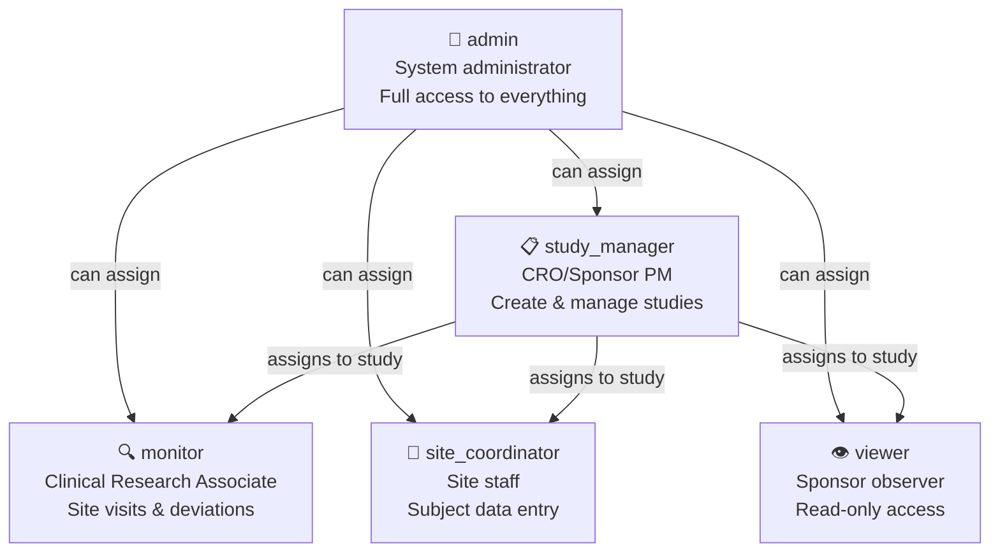

### Permission Matrix

| Action | admin | study_manager | monitor | site_coordinator | viewer |
|---|:---:|:---:|:---:|:---:|:---:|
| Create study | ✓ | ✓ | | | |
| Edit study | ✓ | ✓ (own) | | | |
| Delete study | ✓ | | | | |
| View study | ✓ | ✓ (assigned) | ✓ (assigned) | ✓ (assigned) | ✓ (assigned) |
| Manage study team | ✓ | ✓ (own) | | | |
| Create/edit site | ✓ | ✓ | | | |
| View site | ✓ | ✓ | ✓ | ✓ (own) | ✓ |
| Enroll subject | ✓ | ✓ | ✓ | ✓ (own site) | |
| Update subject status | ✓ | ✓ | ✓ | ✓ (own site) | |
| View subjects | ✓ | ✓ | ✓ | ✓ (own site) | ✓ |
| Create monitoring visit | ✓ | ✓ | ✓ | | |
| Complete monitoring visit | ✓ | ✓ | ✓ (assigned) | | |
| Log deviation | ✓ | ✓ | ✓ | ✓ | |
| Resolve deviation | ✓ | ✓ | ✓ | | |
| Manage milestones | ✓ | ✓ | | | |
| Manage documents | ✓ | ✓ | ✓ | | |
| View audit logs | ✓ | | | | |
| Manage users | ✓ | | | | |

### Role Scoping: Study Team

Access to clinical data (sites, subjects, visits, deviations) is **study-scoped** via the `study_team` table. Users must be explicitly added to a study team to see its data. Admins bypass this check.

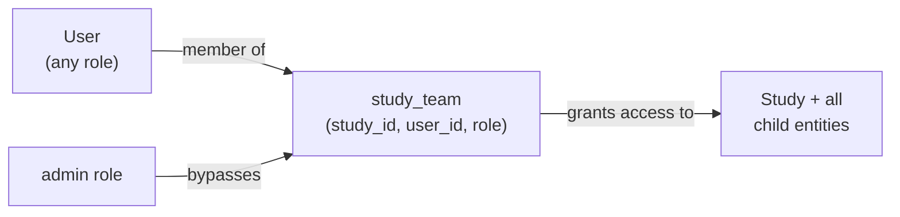

---

## Core Modules & Functional Requirements

### Module 1: Studies

The central entity. Everything in the system belongs to a study.

**States:**

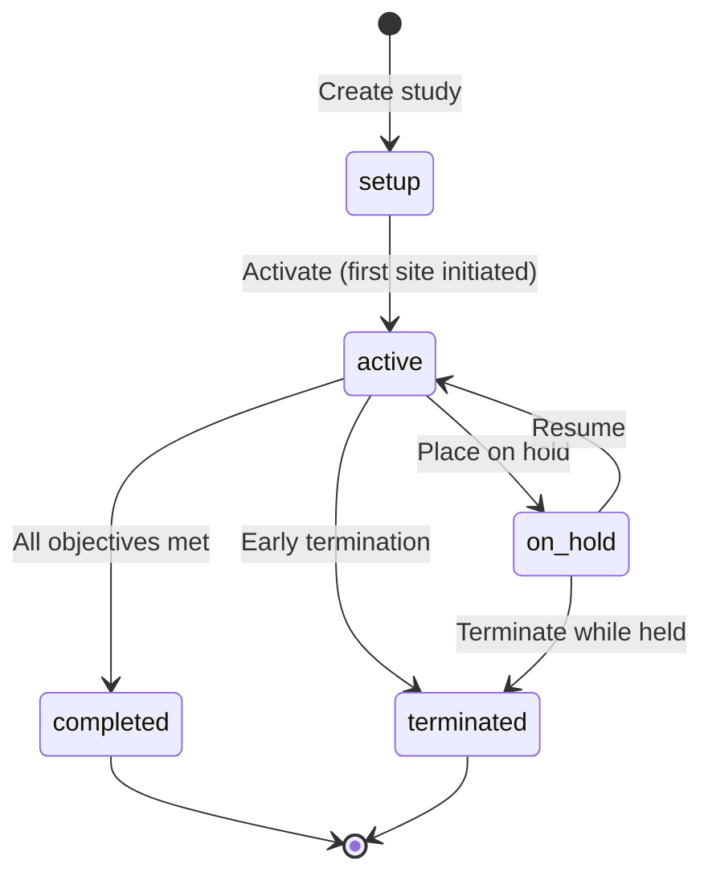

**Required fields on creation:**
- Protocol Number (unique, e.g. `PROTO-2026-001`)
- Title
- Phase (Phase I / II / III / IV / Observational)
- Therapeutic Area
- Sponsor Name
- Indication
- Target Enrollment (integer)
- Planned Start Date
- Planned End Date

**Study Detail Hub** (tabbed page at `/dashboard/studies/[id]`):
- **Overview** — key metrics cards, enrollment progress, upcoming milestones
- **Sites** — sites table with status, enrollment counts
- **Subjects** — cross-site subject roster
- **Monitoring** — visit schedule and history
- **Deviations** — deviation log
- **Milestones** — timeline with planned vs actual
- **Documents** — document registry

---

### Module 2: Sites

Clinical research sites conducting the trial.

**States:**

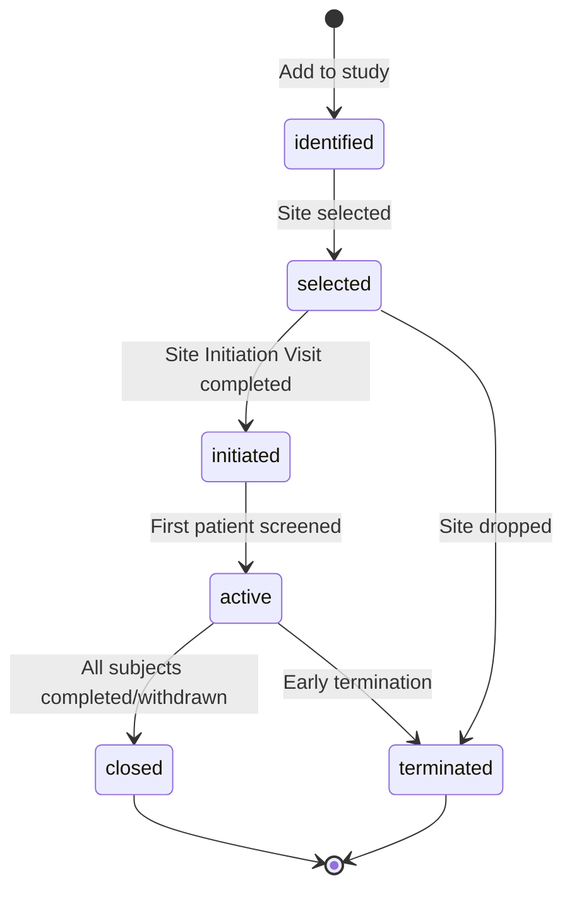

**Key fields:**
- Site Number (unique within study, e.g. `001`)
- Name, City, Country
- Principal Investigator name + email
- Target Enrollment
- Enrolled Count (auto-maintained by trigger)
- Screen Failures (auto-maintained by trigger)
- Initiated Date, Closed Date

**Site Detail** shows:
- Enrollment gauge (enrolled / target)
- Next scheduled monitoring visit
- Open deviations count by severity
- Active subjects list

---

### Module 3: Subject Enrollment

Patient tracking with full GCP pseudonymization compliance.

**Subject Number Format:** `{site_number}-{sequence}` (e.g., `001-003` = Site 001, Subject 3)

**States:**

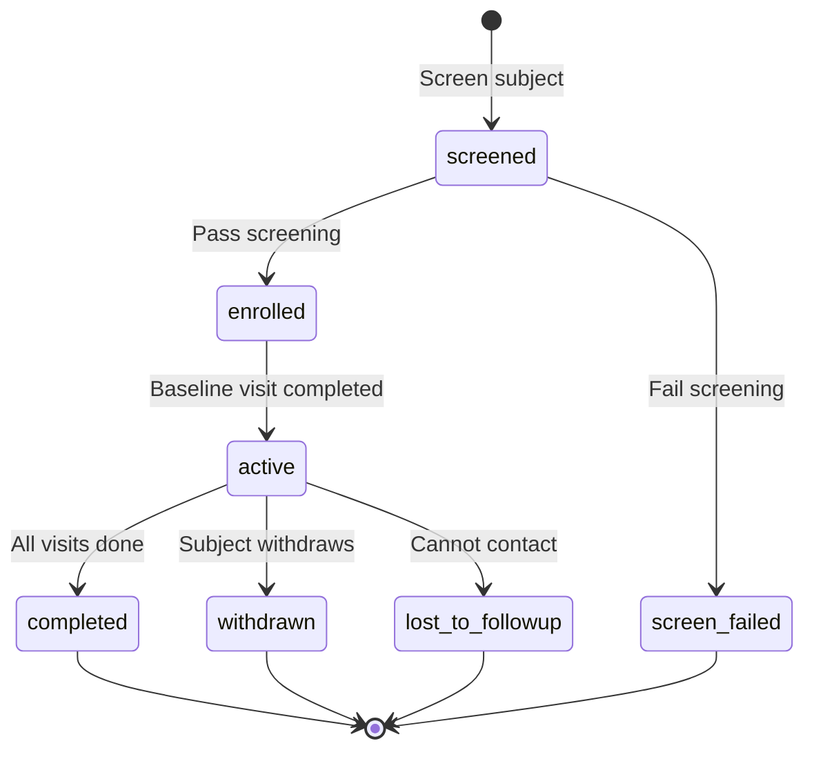

**Privacy Rules (GCP Compliance):**
- Store `subject_number` (site-subject code) and `initials` only
- No full names, date of birth, address, or contact info in this table
- Link to EDC system (future) for clinical data

**Enrollment Trigger (Postgres):**
When `subjects.status` changes, automatically recalculates:
- `sites.enrolled_count` = subjects where status NOT IN ('screened', 'screen_failed')
- `sites.screen_failures` = subjects where status = 'screen_failed'

---

### Module 4: Monitoring Visits

CRA site visits — the primary GCP oversight mechanism.

**Visit Types:**
| Code | Full Name | Description |
|---|---|---|
| SIV | Site Initiation Visit | First visit to train site staff |
| IMV | Interim Monitoring Visit | Routine ongoing monitoring |
| COV | Close-Out Visit | Final visit to close site |
| Remote | Remote Visit | Off-site review |
| For_Cause | For-Cause Visit | Triggered by issue/risk |

**States:**

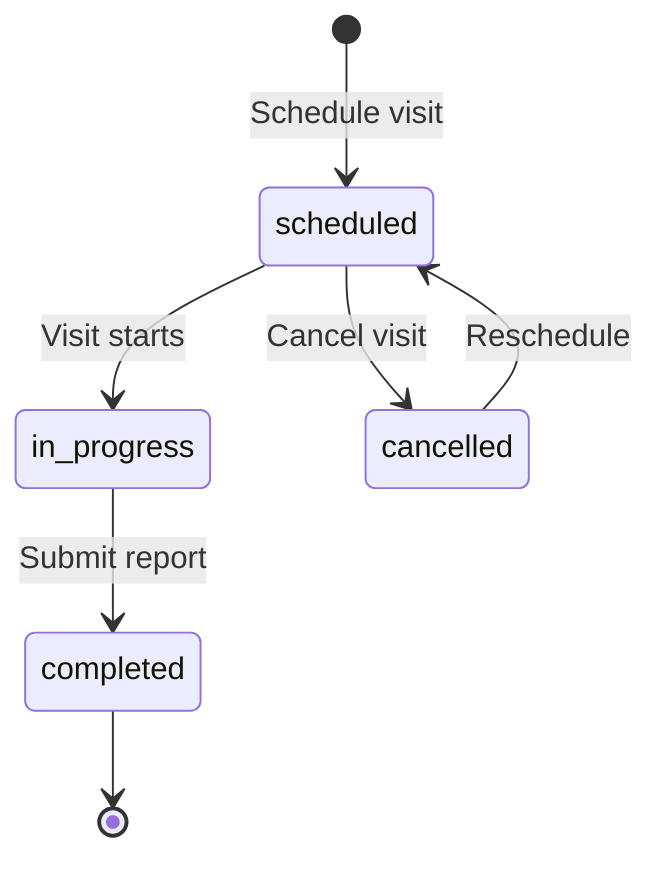

**Overdue Logic:**
A visit is flagged overdue when `planned_date < today` AND `status = 'scheduled'`.

**Completion captures:**
- Actual Date
- Subjects Reviewed (count)
- Findings Summary (text)
- Report Due Date (auto: actual_date + 10 calendar days)

---

### Module 5: Protocol Deviations

Tracking non-compliance events for regulatory reporting.

**Categories:**
`protocol` | `gcp` | `informed_consent` | `ip_handling` | `eligibility` | `visit_window` | `other`

**Severity Levels:**

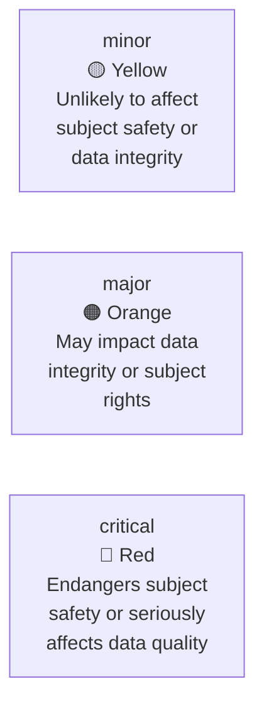

**States:**

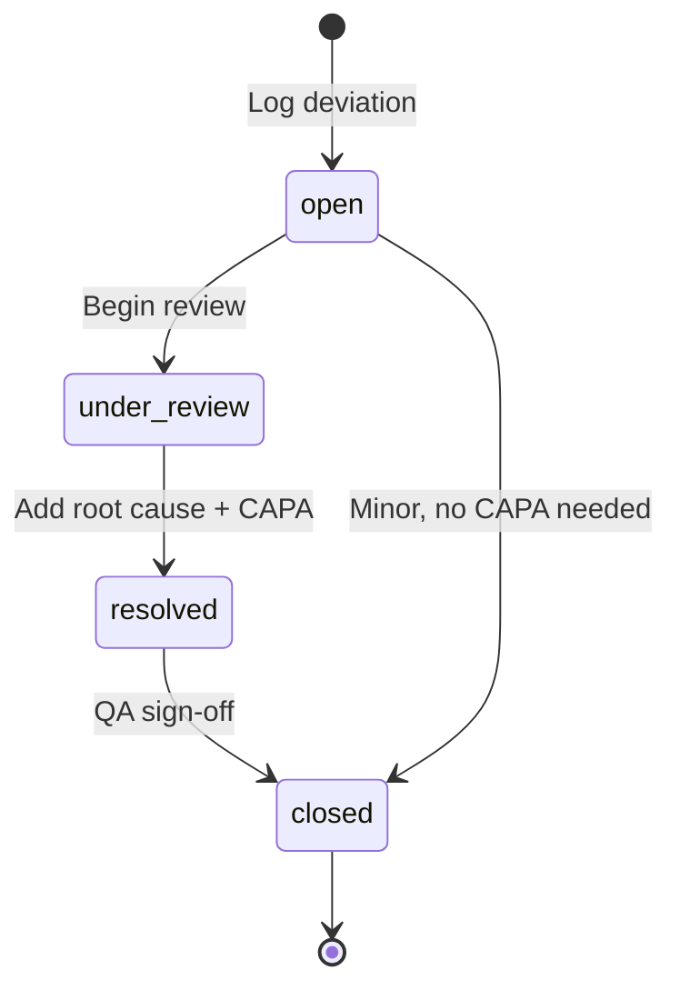

**Deviation Number Format:** `DEV-{protocol_number}-{YYYY}-{seq:03d}`
Example: `DEV-PROTO-2026-001-007`

**Resolution requires:**
- Root Cause (text)
- Corrective and Preventive Action (CAPA)
- Resolved Date

---

### Module 6: Milestones

Study timeline management.

**Standard milestones auto-created with each new study:**
1. Protocol Finalized
2. IRB/Ethics Approval Received
3. First Site Initiated (FSI)
4. First Patient In (FPI)
5. Last Patient In (LPI)
6. Last Patient Out (LPO)
7. Database Lock
8. Primary Analysis Complete
9. Clinical Study Report Submitted

**Status auto-logic:**
- `at_risk` — planned_date within 14 days AND status = 'pending'
- `missed` — planned_date < today AND status = 'pending'
- `completed` — actual_date is set

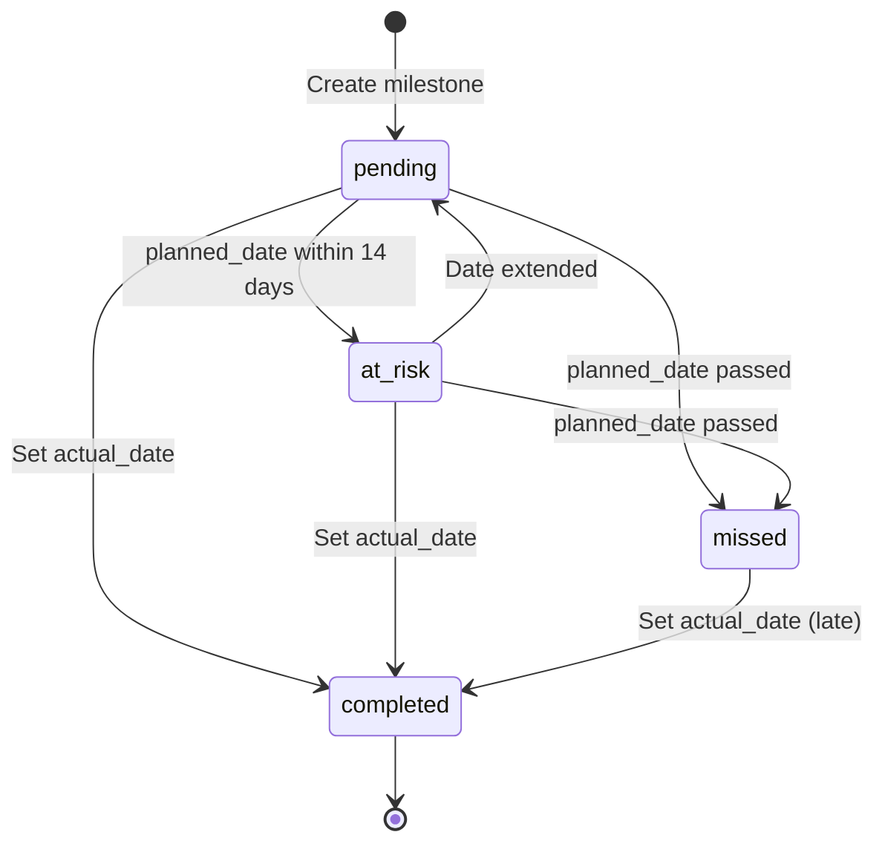

---

### Module 7: Documents

Document registry with metadata tracking (file upload deferred to Week 1).

**Document Types:**
`protocol` | `icf` | `investigator_brochure` | `regulatory_submission` | `monitoring_report` | `deviation_report` | `other`

**Version States:**
`draft → under_review → approved → superseded`

**Day 1 scope:** Store metadata only. `file_url` column exists but is empty. Upload button shows "Coming soon."

---

### Module 8: Portfolio Dashboard

The command center for study managers and monitors.

**Study Manager view — metric cards:**
- Total Active Studies
- Total Sites (across all studies)
- Total Subjects Enrolled
- Open Deviations (critical + major highlighted)

**Enrollment table per study:**
- Protocol #, Study Title, Phase, Sites Active, Enrolled, Target, % Complete (progress bar)

**Upcoming Monitoring Visits (next 14 days):**
- Visit Type, Site, Study, Monitor, Planned Date

**Open Deviations by Severity:**
- Critical count (red), Major count (orange), Minor count (yellow)

**Monitor view** — shows only their assigned studies and their personal visit queue.

**Site Coordinator view** — shows only their site's metrics and subject list.

---

## Data Model

### Complete Entity Relationship Diagram

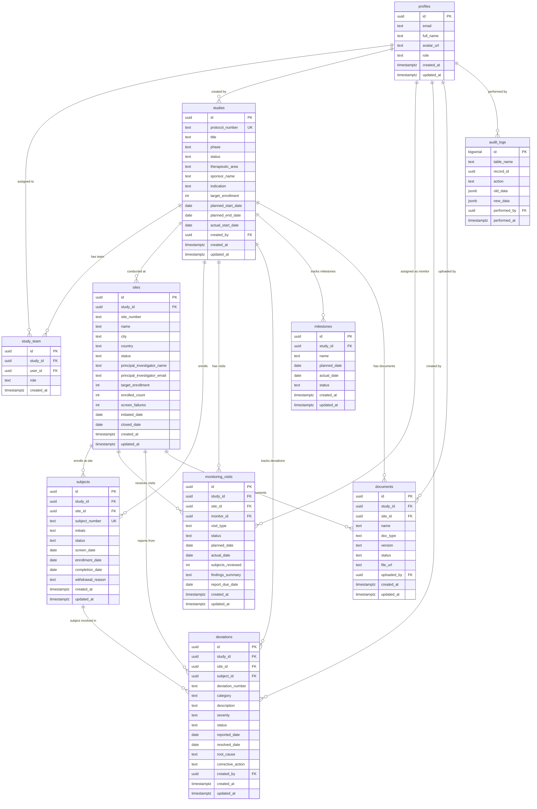

---

## Key Workflows

### Study Setup Flow

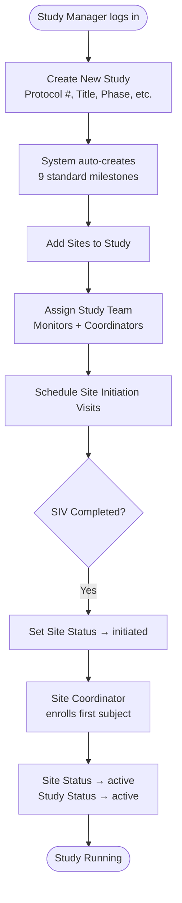

### Subject Enrollment Flow

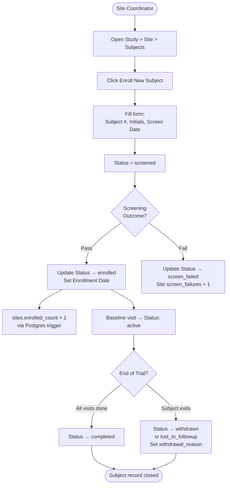

### Monitoring Visit Flow

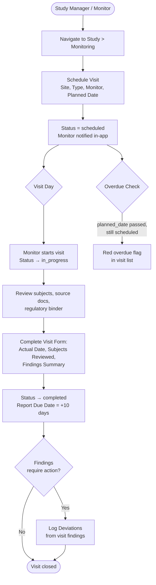

### Deviation Resolution Flow

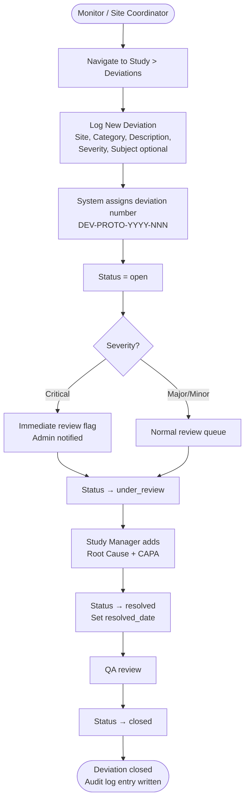

### Audit Trail Flow (21 CFR Part 11)

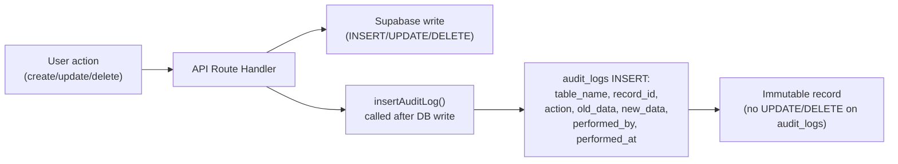

---

## API Design

### Route Map

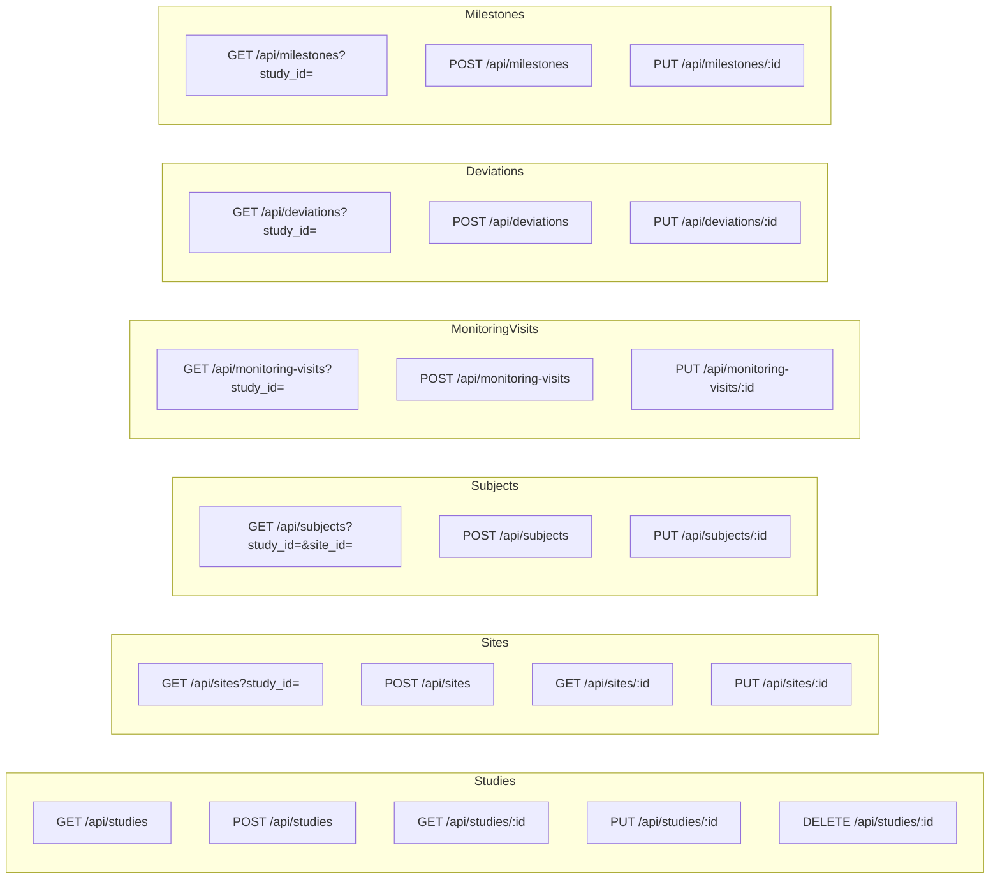

### Standard Response Envelope

All API routes use the existing typed response pattern from `src/types/api.ts`:

```typescript
// Success
{ success: true, data: T, message?: string, metadata?: { pagination?: {...} } }

// Error
{ success: false, error: { code?: string, message: string }, details?: unknown }
```

### Audit Log Helper

Every mutation API route calls this after the DB write:

```typescript
async function insertAuditLog(supabase, {
  tableName: string,
  recordId: string,
  action: 'INSERT' | 'UPDATE' | 'DELETE',
  oldData?: Record<string, unknown>,
  newData?: Record<string, unknown>,
  performedBy: string
})
```

---

## Non-Functional Requirements

### Security

| Requirement | Implementation |
|---|---|
| Authentication | Supabase Auth JWT, refreshed by middleware on every request |
| Authorization | RLS on every table (defense in depth: enforced even if API layer fails) |
| Study-scoped access | `study_team` join table; no data visible outside team membership |
| Input validation | Zod schemas on every API route + form |
| No PII in subjects | Subject number + initials only; no names, DOB, or contact info |
| Admin elevation | Role stored in `profiles.role`, checked by RLS and `RoleGuard` component |

### Performance

| Target | Implementation |
|---|---|
| List pages < 200ms | Indexed foreign keys on every FK column |
| Study detail < 300ms | Parallel data fetching with TanStack Query |
| Enrollment counts | Denormalized on `sites` table via trigger (no COUNT queries on hot paths) |
| Pagination | TanStack Table handles client-side pagination; API returns full dataset per study |

### Data Integrity

| Requirement | Implementation |
|---|---|
| `updated_at` maintenance | Postgres trigger `set_updated_at()` on all tables |
| Referential integrity | FK constraints with `ON DELETE CASCADE` (study deleted → all child data deleted) |
| Unique subject numbers | `UNIQUE(study_id, subject_number)` constraint |
| Unique site numbers | `UNIQUE(study_id, site_number)` constraint |
| Unique protocol numbers | `UNIQUE` on `studies.protocol_number` |

---

## Compliance Architecture

### 21 CFR Part 11 Coverage Map

| Requirement | Status | Implementation |
|---|---|---|
| Audit trail (who, what, when) | **Day 1** | `audit_logs` table, written by API routes |
| User authentication | **Done** | Supabase Auth, email verification |
| Role-based access control | **Day 1** | 5-role RBAC with RLS |
| Data integrity / no unauthorized modification | **Day 1** | RLS policies, FK constraints |
| Unique user identification | **Done** | `auth.uid()` tracked everywhere |
| Electronic signatures | **Deferred** | Week 1 — approval workflows |
| System validation documentation | **Deferred** | Future — IQ/OQ/PQ docs |

### GCP Compliance Coverage Map

| ICH-GCP Element | Status | Implementation |
|---|---|---|
| Subject pseudonymization | **Day 1** | Subject # + initials only |
| Site monitoring records | **Day 1** | Monitoring visits module |
| Protocol deviation tracking | **Day 1** | Deviations module |
| Investigator oversight | **Day 1** | PI name on site record |
| Trial master file | **Deferred** | Documents module (metadata Day 1, upload Week 1) |
| Informed consent tracking | **Deferred** | ICF document + subject link Week 1 |

---

## Scope Boundaries

### Day 1 — Shippable MVP

| Module | Scope |
|---|---|
| Auth + RBAC | 5 roles, study-team scoping |
| Studies | Full CRUD, status lifecycle |
| Sites | Full CRUD, status lifecycle, enrollment counts |
| Subjects | Enrollment, status transitions, pseudonymized |
| Monitoring Visits | Schedule, complete, overdue flags |
| Deviations | Log, review, resolve, close |
| Milestones | Auto-create 9 standard, planned/actual dates |
| Documents | Metadata only, no file upload |
| Dashboard | Enrollment metrics, upcoming visits, open deviations |
| Audit Logs | Written on every mutation (no UI) |

### Week 1 Extensions

| Feature | Complexity | Notes |
|---|---|---|
| Document file upload | Medium | Supabase Storage + signed URLs |
| Email notifications | Low | Resend integration for overdue visits, new deviations |
| Audit log viewer UI | Low | Admin table showing audit_logs |
| Study team management UI | Medium | Add/remove team members from study |
| Deviation PDF export | Low | Browser print stylesheet |
| Enrollment forecasting | Medium | Linear projection chart from current rate |
| Password reset | Low | Supabase `resetPasswordForEmail` |

### Future (Post-Week 1)

| Feature | Why Deferred | Substitute on Day 1 |
|---|---|---|
| Electronic signatures (21 CFR Part 11) | Requires signature capture, legal workflow, identity binding | "Approved by [name] at [timestamp]" text label |
| EDC integration | External API contract + auth + webhook infrastructure | Manual subject count entry |
| eTMF integration | Separate Veeva product; complex document sync | Local document metadata table |
| Budget & financials | Per-visit payment calculation is a product in itself | Not included |
| Mobile app (React Native) | Separate build pipeline | Responsive web works on tablet |
| AI enrollment prediction | Requires historical data + Claude API | Static progress bars |
| Adaptive trial management | Complex regulatory workflow | Not applicable to MVP |
| Blockchain audit trail | Overkill for MVP; no buyer asks for it | Postgres audit_logs is GCP-sufficient |

---

## Architectural Decisions

### Decision 1: Role stored in `profiles.role`, not separate table

**Rationale:** Simplicity. A role-per-user-per-study (full RBAC) would require a separate `user_roles` table and complex RLS joins. The current design uses `profiles.role` for system-level capability and `study_team.role` for study-level scoping. This covers all Day 1 use cases.

**Trade-off:** A monitor can't be a study_manager on one study and a viewer on another. Acceptable for MVP.

### Decision 2: `enrolled_count` denormalized on `sites`

**Rationale:** Enrollment progress is shown everywhere (dashboard, site list, study overview). Running `COUNT()` on every render causes N+1 problems. A Postgres trigger maintains accuracy automatically.

**Trade-off:** Trigger adds write complexity. Risk is low — triggers are atomic with the parent write.

### Decision 3: API routes over direct Supabase client calls from Server Components

**Rationale:** Follows existing project pattern. API routes allow: (1) audit log injection on every mutation, (2) consistent authorization checks, (3) typed response envelope, (4) TanStack Query cache compatibility. Server Components calling Supabase directly would bypass the audit trail.

### Decision 4: Milestones auto-created, not templated

**Rationale:** Every Phase II+ trial has the same 9 standard milestones. Auto-creating them at study creation time saves setup friction. Users edit planned dates rather than creating from scratch.

### Decision 5: Subjects are study-scoped, not site-scoped for the primary key

**Rationale:** Subjects can theoretically transfer between sites. `subject_number` is unique per study (`UNIQUE(study_id, subject_number)`), and `site_id` is a foreign key that can be updated. This matches how Veeva and most CTMS systems handle it.
