# Full Build Plan — NextGen CTMS

> Complete feature delivery plan across Day 1, Day 2, Week 1, Week 2, and Week 3.
> Every Veeva CTMS feature is covered. Ordered by dependency and complexity.
> Each sprint is AI-executable using the existing `items` module as the pattern template.

---

## Master Timeline

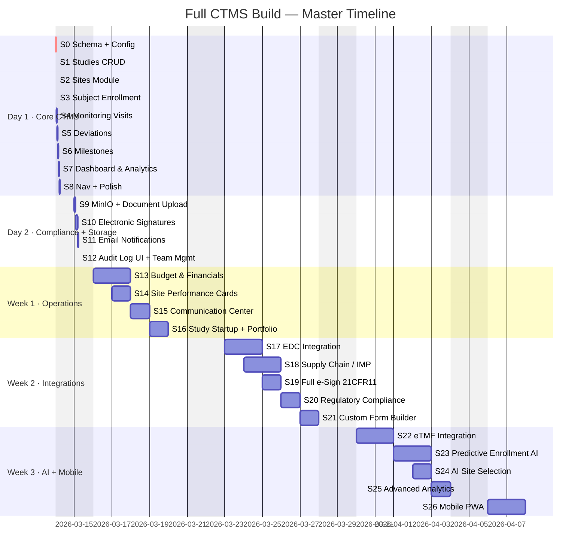

---

## Mandatory API Verification (All Sprints)

Use this checklist at the end of every sprint before marking it complete:

1. Confirm the Next.js app is running locally at `http://localhost:3000`.
2. Test every new/updated API route with real requests (not just type-checking):
   - Unauthenticated request should return the expected `401` or `403`.
   - Authenticated happy-path request should succeed with the expected payload.
   - At least one validation/error-path request should return the expected `400`/error shape.
3. If a route writes to Supabase, verify data side effects with SQL (`insert/update/delete`, related records, audit logs).
4. If a route depends on RLS, explicitly verify policy behavior for the intended role(s).
5. Document what was tested and any known gaps in the sprint handoff.

Do not finalize a sprint if any created API route is untested.

---

## Full Dependency Graph

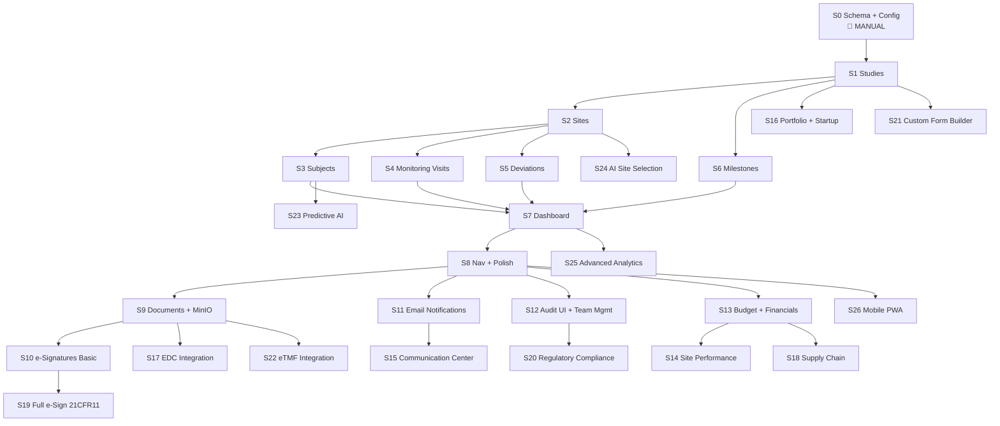

---

# DAY 1 — Core CTMS

---

## Sprint 0 — Foundation

**Duration:** 45 min | **Type:** MANUAL — ✅ COMPLETED

### Step 1: Run the database migration in Supabase SQL Editor

```sql
-- File: supabase/migrations/20260314000001_ctms_schema.sql

ALTER TABLE public.profiles
  DROP CONSTRAINT IF EXISTS profiles_role_check;
ALTER TABLE public.profiles
  ADD CONSTRAINT profiles_role_check
  CHECK (role IN ('admin','study_manager','monitor','site_coordinator','viewer'));

CREATE TABLE public.studies (
  id                uuid PRIMARY KEY DEFAULT gen_random_uuid(),
  protocol_number   text NOT NULL UNIQUE,
  title             text NOT NULL,
  phase             text NOT NULL CHECK (phase IN ('Phase I','Phase II','Phase III','Phase IV','Observational')),
  status            text NOT NULL DEFAULT 'setup' CHECK (status IN ('setup','active','on_hold','completed','terminated')),
  therapeutic_area  text,
  sponsor_name      text,
  indication        text,
  target_enrollment integer,
  planned_start_date date,
  planned_end_date   date,
  actual_start_date  date,
  created_by        uuid REFERENCES auth.users(id),
  created_at        timestamptz NOT NULL DEFAULT now(),
  updated_at        timestamptz NOT NULL DEFAULT now()
);

CREATE TABLE public.study_team (
  id         uuid PRIMARY KEY DEFAULT gen_random_uuid(),
  study_id   uuid NOT NULL REFERENCES public.studies(id) ON DELETE CASCADE,
  user_id    uuid NOT NULL REFERENCES auth.users(id) ON DELETE CASCADE,
  role       text NOT NULL CHECK (role IN ('study_manager','monitor','site_coordinator','viewer')),
  created_at timestamptz NOT NULL DEFAULT now(),
  UNIQUE(study_id, user_id)
);

CREATE TABLE public.sites (
  id                           uuid PRIMARY KEY DEFAULT gen_random_uuid(),
  study_id                     uuid NOT NULL REFERENCES public.studies(id) ON DELETE CASCADE,
  site_number                  text NOT NULL,
  name                         text NOT NULL,
  city                         text,
  country                      text NOT NULL DEFAULT 'US',
  status                       text NOT NULL DEFAULT 'identified' CHECK (status IN ('identified','selected','initiated','active','closed','terminated')),
  principal_investigator_name  text,
  principal_investigator_email text,
  target_enrollment            integer DEFAULT 0,
  enrolled_count               integer NOT NULL DEFAULT 0,
  screen_failures              integer NOT NULL DEFAULT 0,
  initiated_date               date,
  closed_date                  date,
  created_at                   timestamptz NOT NULL DEFAULT now(),
  updated_at                   timestamptz NOT NULL DEFAULT now(),
  UNIQUE(study_id, site_number)
);

CREATE TABLE public.subjects (
  id               uuid PRIMARY KEY DEFAULT gen_random_uuid(),
  study_id         uuid NOT NULL REFERENCES public.studies(id) ON DELETE CASCADE,
  site_id          uuid NOT NULL REFERENCES public.sites(id) ON DELETE CASCADE,
  subject_number   text NOT NULL,
  initials         text,
  status           text NOT NULL DEFAULT 'screened' CHECK (status IN ('screened','enrolled','active','completed','withdrawn','screen_failed','lost_to_followup')),
  screen_date      date,
  enrollment_date  date,
  completion_date  date,
  withdrawal_reason text,
  created_at       timestamptz NOT NULL DEFAULT now(),
  updated_at       timestamptz NOT NULL DEFAULT now(),
  UNIQUE(study_id, subject_number)
);

CREATE TABLE public.monitoring_visits (
  id               uuid PRIMARY KEY DEFAULT gen_random_uuid(),
  study_id         uuid NOT NULL REFERENCES public.studies(id) ON DELETE CASCADE,
  site_id          uuid NOT NULL REFERENCES public.sites(id) ON DELETE CASCADE,
  monitor_id       uuid REFERENCES auth.users(id),
  visit_type       text NOT NULL CHECK (visit_type IN ('SIV','IMV','COV','Remote','For_Cause')),
  status           text NOT NULL DEFAULT 'scheduled' CHECK (status IN ('scheduled','in_progress','completed','cancelled')),
  planned_date     date NOT NULL,
  actual_date      date,
  subjects_reviewed integer DEFAULT 0,
  findings_summary text,
  report_due_date  date,
  created_at       timestamptz NOT NULL DEFAULT now(),
  updated_at       timestamptz NOT NULL DEFAULT now()
);

CREATE TABLE public.deviations (
  id                uuid PRIMARY KEY DEFAULT gen_random_uuid(),
  study_id          uuid NOT NULL REFERENCES public.studies(id) ON DELETE CASCADE,
  site_id           uuid NOT NULL REFERENCES public.sites(id) ON DELETE CASCADE,
  subject_id        uuid REFERENCES public.subjects(id) ON DELETE SET NULL,
  deviation_number  text NOT NULL,
  category          text NOT NULL CHECK (category IN ('protocol','gcp','informed_consent','ip_handling','eligibility','visit_window','other')),
  description       text NOT NULL,
  severity          text NOT NULL DEFAULT 'minor' CHECK (severity IN ('minor','major','critical')),
  status            text NOT NULL DEFAULT 'open' CHECK (status IN ('open','under_review','resolved','closed')),
  reported_date     date NOT NULL DEFAULT CURRENT_DATE,
  resolved_date     date,
  root_cause        text,
  corrective_action text,
  created_by        uuid REFERENCES auth.users(id),
  created_at        timestamptz NOT NULL DEFAULT now(),
  updated_at        timestamptz NOT NULL DEFAULT now()
);

CREATE TABLE public.milestones (
  id           uuid PRIMARY KEY DEFAULT gen_random_uuid(),
  study_id     uuid NOT NULL REFERENCES public.studies(id) ON DELETE CASCADE,
  name         text NOT NULL,
  planned_date date,
  actual_date  date,
  status       text NOT NULL DEFAULT 'pending' CHECK (status IN ('pending','at_risk','completed','missed')),
  created_at   timestamptz NOT NULL DEFAULT now(),
  updated_at   timestamptz NOT NULL DEFAULT now()
);

CREATE TABLE public.documents (
  id          uuid PRIMARY KEY DEFAULT gen_random_uuid(),
  study_id    uuid NOT NULL REFERENCES public.studies(id) ON DELETE CASCADE,
  site_id     uuid REFERENCES public.sites(id) ON DELETE CASCADE,
  name        text NOT NULL,
  doc_type    text NOT NULL CHECK (doc_type IN ('protocol','icf','investigator_brochure','regulatory_submission','monitoring_report','deviation_report','other')),
  version     text NOT NULL DEFAULT '1.0',
  status      text NOT NULL DEFAULT 'draft' CHECK (status IN ('draft','under_review','approved','superseded')),
  file_url    text,
  file_size   bigint,
  file_mime   text,
  s3_key      text,
  uploaded_by uuid REFERENCES auth.users(id),
  created_at  timestamptz NOT NULL DEFAULT now(),
  updated_at  timestamptz NOT NULL DEFAULT now()
);

CREATE TABLE public.audit_logs (
  id           bigserial PRIMARY KEY,
  table_name   text NOT NULL,
  record_id    uuid,
  action       text NOT NULL CHECK (action IN ('INSERT','UPDATE','DELETE')),
  old_data     jsonb,
  new_data     jsonb,
  performed_by uuid REFERENCES auth.users(id),
  performed_at timestamptz NOT NULL DEFAULT now()
);

-- Indexes
CREATE INDEX idx_study_team_user_id          ON public.study_team(user_id);
CREATE INDEX idx_study_team_study_id         ON public.study_team(study_id);
CREATE INDEX idx_sites_study_id              ON public.sites(study_id);
CREATE INDEX idx_subjects_study_id           ON public.subjects(study_id);
CREATE INDEX idx_subjects_site_id            ON public.subjects(site_id);
CREATE INDEX idx_monitoring_visits_study_id  ON public.monitoring_visits(study_id);
CREATE INDEX idx_monitoring_visits_monitor   ON public.monitoring_visits(monitor_id);
CREATE INDEX idx_deviations_study_id         ON public.deviations(study_id);
CREATE INDEX idx_milestones_study_id         ON public.milestones(study_id);
CREATE INDEX idx_documents_study_id          ON public.documents(study_id);
CREATE INDEX idx_audit_logs_table_record     ON public.audit_logs(table_name, record_id);
CREATE INDEX idx_audit_logs_performed_by     ON public.audit_logs(performed_by);

-- updated_at triggers
CREATE TRIGGER set_studies_updated_at          BEFORE UPDATE ON public.studies          FOR EACH ROW EXECUTE FUNCTION public.set_updated_at();
CREATE TRIGGER set_sites_updated_at            BEFORE UPDATE ON public.sites            FOR EACH ROW EXECUTE FUNCTION public.set_updated_at();
CREATE TRIGGER set_subjects_updated_at         BEFORE UPDATE ON public.subjects         FOR EACH ROW EXECUTE FUNCTION public.set_updated_at();
CREATE TRIGGER set_monitoring_visits_updated_at BEFORE UPDATE ON public.monitoring_visits FOR EACH ROW EXECUTE FUNCTION public.set_updated_at();
CREATE TRIGGER set_deviations_updated_at       BEFORE UPDATE ON public.deviations       FOR EACH ROW EXECUTE FUNCTION public.set_updated_at();
CREATE TRIGGER set_milestones_updated_at       BEFORE UPDATE ON public.milestones       FOR EACH ROW EXECUTE FUNCTION public.set_updated_at();
CREATE TRIGGER set_documents_updated_at        BEFORE UPDATE ON public.documents        FOR EACH ROW EXECUTE FUNCTION public.set_updated_at();

-- Enrollment sync trigger
CREATE OR REPLACE FUNCTION public.sync_site_enrollment()
RETURNS TRIGGER LANGUAGE plpgsql AS $$
BEGIN
  UPDATE public.sites SET
    enrolled_count = (SELECT COUNT(*) FROM public.subjects WHERE site_id = NEW.site_id AND status NOT IN ('screened','screen_failed')),
    screen_failures = (SELECT COUNT(*) FROM public.subjects WHERE site_id = NEW.site_id AND status = 'screen_failed')
  WHERE id = NEW.site_id;
  RETURN NEW;
END;
$$;
CREATE TRIGGER sync_enrollment_on_subject_change
  AFTER INSERT OR UPDATE OF status ON public.subjects
  FOR EACH ROW EXECUTE FUNCTION public.sync_site_enrollment();

-- RLS
ALTER TABLE public.studies           ENABLE ROW LEVEL SECURITY;
ALTER TABLE public.study_team        ENABLE ROW LEVEL SECURITY;
ALTER TABLE public.sites             ENABLE ROW LEVEL SECURITY;
ALTER TABLE public.subjects          ENABLE ROW LEVEL SECURITY;
ALTER TABLE public.monitoring_visits ENABLE ROW LEVEL SECURITY;
ALTER TABLE public.deviations        ENABLE ROW LEVEL SECURITY;
ALTER TABLE public.milestones        ENABLE ROW LEVEL SECURITY;
ALTER TABLE public.documents         ENABLE ROW LEVEL SECURITY;
ALTER TABLE public.audit_logs        ENABLE ROW LEVEL SECURITY;

-- Studies
CREATE POLICY "Admins full access to studies" ON public.studies FOR ALL TO authenticated USING (EXISTS (SELECT 1 FROM public.profiles WHERE id = auth.uid() AND role = 'admin'));
CREATE POLICY "Study team can view studies" ON public.studies FOR SELECT TO authenticated USING (EXISTS (SELECT 1 FROM public.study_team WHERE study_team.study_id = studies.id AND study_team.user_id = auth.uid()));
CREATE POLICY "Study managers can create studies" ON public.studies FOR INSERT TO authenticated WITH CHECK (EXISTS (SELECT 1 FROM public.profiles WHERE id = auth.uid() AND role IN ('admin','study_manager')));
CREATE POLICY "Study managers can update studies" ON public.studies FOR UPDATE TO authenticated USING (EXISTS (SELECT 1 FROM public.study_team WHERE study_team.study_id = studies.id AND study_team.user_id = auth.uid() AND study_team.role = 'study_manager'));

-- study_team
CREATE POLICY "Admins manage study team" ON public.study_team FOR ALL TO authenticated USING (EXISTS (SELECT 1 FROM public.profiles WHERE id = auth.uid() AND role = 'admin'));
CREATE POLICY "Users view own membership" ON public.study_team FOR SELECT TO authenticated USING (user_id = auth.uid());
CREATE POLICY "Managers manage study team" ON public.study_team FOR ALL TO authenticated USING (EXISTS (SELECT 1 FROM public.study_team st2 WHERE st2.study_id = study_team.study_id AND st2.user_id = auth.uid() AND st2.role = 'study_manager'));

-- Sites
CREATE POLICY "Admins manage all sites" ON public.sites FOR ALL TO authenticated USING (EXISTS (SELECT 1 FROM public.profiles WHERE id = auth.uid() AND role = 'admin'));
CREATE POLICY "Study team can view sites" ON public.sites FOR SELECT TO authenticated USING (EXISTS (SELECT 1 FROM public.study_team WHERE study_team.study_id = sites.study_id AND study_team.user_id = auth.uid()));
CREATE POLICY "Managers can manage sites" ON public.sites FOR ALL TO authenticated USING (EXISTS (SELECT 1 FROM public.profiles WHERE id = auth.uid() AND role IN ('admin','study_manager')));

-- Subjects
CREATE POLICY "Admins manage all subjects" ON public.subjects FOR ALL TO authenticated USING (EXISTS (SELECT 1 FROM public.profiles WHERE id = auth.uid() AND role = 'admin'));
CREATE POLICY "Study team can view subjects" ON public.subjects FOR SELECT TO authenticated USING (EXISTS (SELECT 1 FROM public.study_team WHERE study_team.study_id = subjects.study_id AND study_team.user_id = auth.uid()));
CREATE POLICY "Clinical roles can manage subjects" ON public.subjects FOR ALL TO authenticated USING (EXISTS (SELECT 1 FROM public.profiles WHERE id = auth.uid() AND role IN ('admin','study_manager','monitor','site_coordinator')));

-- Monitoring visits, deviations, milestones, documents — same study-team pattern (omitted for brevity, included in migration file)
CREATE POLICY "Admins manage visits" ON public.monitoring_visits FOR ALL TO authenticated USING (EXISTS (SELECT 1 FROM public.profiles WHERE id = auth.uid() AND role = 'admin'));
CREATE POLICY "Study team view visits" ON public.monitoring_visits FOR SELECT TO authenticated USING (EXISTS (SELECT 1 FROM public.study_team WHERE study_team.study_id = monitoring_visits.study_id AND study_team.user_id = auth.uid()));
CREATE POLICY "Monitors manage visits" ON public.monitoring_visits FOR ALL TO authenticated USING (EXISTS (SELECT 1 FROM public.profiles WHERE id = auth.uid() AND role IN ('admin','study_manager','monitor')));

CREATE POLICY "Admins manage deviations" ON public.deviations FOR ALL TO authenticated USING (EXISTS (SELECT 1 FROM public.profiles WHERE id = auth.uid() AND role = 'admin'));
CREATE POLICY "Study team view deviations" ON public.deviations FOR SELECT TO authenticated USING (EXISTS (SELECT 1 FROM public.study_team WHERE study_team.study_id = deviations.study_id AND study_team.user_id = auth.uid()));
CREATE POLICY "Clinical roles manage deviations" ON public.deviations FOR ALL TO authenticated USING (EXISTS (SELECT 1 FROM public.profiles WHERE id = auth.uid() AND role IN ('admin','study_manager','monitor','site_coordinator')));

CREATE POLICY "Admins manage milestones" ON public.milestones FOR ALL TO authenticated USING (EXISTS (SELECT 1 FROM public.profiles WHERE id = auth.uid() AND role = 'admin'));
CREATE POLICY "Study team view milestones" ON public.milestones FOR SELECT TO authenticated USING (EXISTS (SELECT 1 FROM public.study_team st WHERE st.study_id = milestones.study_id AND st.user_id = auth.uid()));
CREATE POLICY "Managers manage milestones" ON public.milestones FOR ALL TO authenticated USING (EXISTS (SELECT 1 FROM public.profiles WHERE id = auth.uid() AND role IN ('admin','study_manager')));

CREATE POLICY "Admins manage documents" ON public.documents FOR ALL TO authenticated USING (EXISTS (SELECT 1 FROM public.profiles WHERE id = auth.uid() AND role = 'admin'));
CREATE POLICY "Study team view documents" ON public.documents FOR SELECT TO authenticated USING (EXISTS (SELECT 1 FROM public.study_team st WHERE st.study_id = documents.study_id AND st.user_id = auth.uid()));
CREATE POLICY "Clinical roles manage documents" ON public.documents FOR ALL TO authenticated USING (EXISTS (SELECT 1 FROM public.profiles WHERE id = auth.uid() AND role IN ('admin','study_manager','monitor')));

CREATE POLICY "Admins view audit logs" ON public.audit_logs FOR SELECT TO authenticated USING (EXISTS (SELECT 1 FROM public.profiles WHERE id = auth.uid() AND role = 'admin'));
```

### Step 2: Update source config files

```
src/constants/roles.ts        → add study_manager | monitor | site_coordinator | viewer
src/constants/routes.ts       → add STUDIES, MONITORING routes
src/config/nav.ts             → add CTMS sidebar items
```

### Verification

```sql
SELECT tablename, rowsecurity FROM pg_tables WHERE schemaname = 'public';
-- Every new table should show rowsecurity = true
```

---

## Sprint 1 — Studies CRUD

**Duration:** 2.5 hours (extended for protocol sub-entities) | **AI-executable**

### Additional Migration (run before Sprint 1 code)

Run this in Supabase SQL Editor BEFORE writing any Sprint 1 code.  
File: `supabase/migrations/20260314000002_protocol_entities.sql`

```sql
-- Protocol Objectives
CREATE TABLE public.protocol_objectives (
  id          uuid PRIMARY KEY DEFAULT gen_random_uuid(),
  study_id    uuid NOT NULL REFERENCES public.studies(id) ON DELETE CASCADE,
  type        text NOT NULL CHECK (type IN ('primary','secondary','exploratory')),
  description text NOT NULL,
  sort_order  integer NOT NULL DEFAULT 0,
  created_at  timestamptz NOT NULL DEFAULT now()
);

-- Eligibility Criteria (inclusion + exclusion rules)
CREATE TABLE public.eligibility_criteria (
  id          uuid PRIMARY KEY DEFAULT gen_random_uuid(),
  study_id    uuid NOT NULL REFERENCES public.studies(id) ON DELETE CASCADE,
  type        text NOT NULL CHECK (type IN ('inclusion','exclusion')),
  criterion   text NOT NULL,
  sort_order  integer NOT NULL DEFAULT 0,
  created_at  timestamptz NOT NULL DEFAULT now()
);

-- Study Arms / Treatment Groups
CREATE TABLE public.study_arms (
  id          uuid PRIMARY KEY DEFAULT gen_random_uuid(),
  study_id    uuid NOT NULL REFERENCES public.studies(id) ON DELETE CASCADE,
  name        text NOT NULL,
  arm_type    text NOT NULL CHECK (arm_type IN ('experimental','control','open_label','placebo')),
  description text,
  dose        text,
  route       text,       -- e.g. oral, IV, subcutaneous
  frequency   text,       -- e.g. once daily, BID, weekly
  created_at  timestamptz NOT NULL DEFAULT now()
);

-- Visit Definitions (protocol-level schedule, not individual subject visits)
CREATE TABLE public.visit_definitions (
  id             uuid PRIMARY KEY DEFAULT gen_random_uuid(),
  study_id       uuid NOT NULL REFERENCES public.studies(id) ON DELETE CASCADE,
  name           text NOT NULL,        -- "Screening", "Day 1", "Week 4", "EOS"
  visit_code     text NOT NULL,        -- "SCR", "D1", "W4", "EOS"
  day_target     integer,              -- e.g. 28 means Day 28
  window_before  integer NOT NULL DEFAULT 0,
  window_after   integer NOT NULL DEFAULT 0,
  is_mandatory   boolean NOT NULL DEFAULT true,
  assessments    text[] NOT NULL DEFAULT '{}',  -- ["Blood draw","Vitals","ECG"]
  sort_order     integer NOT NULL DEFAULT 0,
  created_at     timestamptz NOT NULL DEFAULT now(),
  UNIQUE(study_id, visit_code)
);

-- Protocol Endpoints
CREATE TABLE public.protocol_endpoints (
  id          uuid PRIMARY KEY DEFAULT gen_random_uuid(),
  study_id    uuid NOT NULL REFERENCES public.studies(id) ON DELETE CASCADE,
  type        text NOT NULL CHECK (type IN ('primary','secondary','safety','exploratory')),
  description text NOT NULL,
  measurement text,     -- e.g. "ORR at Week 24 per RECIST 1.1"
  timepoint   text,
  sort_order  integer NOT NULL DEFAULT 0,
  created_at  timestamptz NOT NULL DEFAULT now()
);

-- Protocol Amendments (version history)
CREATE TABLE public.protocol_amendments (
  id             uuid PRIMARY KEY DEFAULT gen_random_uuid(),
  study_id       uuid NOT NULL REFERENCES public.studies(id) ON DELETE CASCADE,
  version        text NOT NULL,        -- "v1.0", "v2.0"
  amendment_date date NOT NULL,
  summary        text NOT NULL,
  reason         text,
  document_id    uuid REFERENCES public.documents(id),
  created_by     uuid REFERENCES auth.users(id),
  created_at     timestamptz NOT NULL DEFAULT now()
);

-- Add safety_rules and statistical_plan as free text to studies
ALTER TABLE public.studies
  ADD COLUMN IF NOT EXISTS safety_rules     text,
  ADD COLUMN IF NOT EXISTS statistical_plan text;

-- Indexes
CREATE INDEX idx_objectives_study_id  ON public.protocol_objectives(study_id);
CREATE INDEX idx_eligibility_study_id ON public.eligibility_criteria(study_id);
CREATE INDEX idx_arms_study_id        ON public.study_arms(study_id);
CREATE INDEX idx_visit_defs_study_id  ON public.visit_definitions(study_id);
CREATE INDEX idx_endpoints_study_id   ON public.protocol_endpoints(study_id);
CREATE INDEX idx_amendments_study_id  ON public.protocol_amendments(study_id);

-- RLS
ALTER TABLE public.protocol_objectives  ENABLE ROW LEVEL SECURITY;
ALTER TABLE public.eligibility_criteria ENABLE ROW LEVEL SECURITY;
ALTER TABLE public.study_arms           ENABLE ROW LEVEL SECURITY;
ALTER TABLE public.visit_definitions    ENABLE ROW LEVEL SECURITY;
ALTER TABLE public.protocol_endpoints   ENABLE ROW LEVEL SECURITY;
ALTER TABLE public.protocol_amendments  ENABLE ROW LEVEL SECURITY;

-- Admins full access
CREATE POLICY "Admins manage protocol_objectives"  ON public.protocol_objectives  FOR ALL TO authenticated USING (EXISTS (SELECT 1 FROM public.profiles WHERE id = auth.uid() AND role = 'admin'));
CREATE POLICY "Admins manage eligibility_criteria" ON public.eligibility_criteria FOR ALL TO authenticated USING (EXISTS (SELECT 1 FROM public.profiles WHERE id = auth.uid() AND role = 'admin'));
CREATE POLICY "Admins manage study_arms"           ON public.study_arms           FOR ALL TO authenticated USING (EXISTS (SELECT 1 FROM public.profiles WHERE id = auth.uid() AND role = 'admin'));
CREATE POLICY "Admins manage visit_definitions"    ON public.visit_definitions    FOR ALL TO authenticated USING (EXISTS (SELECT 1 FROM public.profiles WHERE id = auth.uid() AND role = 'admin'));
CREATE POLICY "Admins manage protocol_endpoints"   ON public.protocol_endpoints   FOR ALL TO authenticated USING (EXISTS (SELECT 1 FROM public.profiles WHERE id = auth.uid() AND role = 'admin'));
CREATE POLICY "Admins manage protocol_amendments"  ON public.protocol_amendments  FOR ALL TO authenticated USING (EXISTS (SELECT 1 FROM public.profiles WHERE id = auth.uid() AND role = 'admin'));

-- Study team can view
CREATE POLICY "Study team view protocol_objectives"  ON public.protocol_objectives  FOR SELECT TO authenticated USING (EXISTS (SELECT 1 FROM public.study_team WHERE study_id = protocol_objectives.study_id  AND user_id = auth.uid()));
CREATE POLICY "Study team view eligibility_criteria" ON public.eligibility_criteria FOR SELECT TO authenticated USING (EXISTS (SELECT 1 FROM public.study_team WHERE study_id = eligibility_criteria.study_id AND user_id = auth.uid()));
CREATE POLICY "Study team view study_arms"           ON public.study_arms           FOR SELECT TO authenticated USING (EXISTS (SELECT 1 FROM public.study_team WHERE study_id = study_arms.study_id           AND user_id = auth.uid()));
CREATE POLICY "Study team view visit_definitions"    ON public.visit_definitions    FOR SELECT TO authenticated USING (EXISTS (SELECT 1 FROM public.study_team WHERE study_id = visit_definitions.study_id    AND user_id = auth.uid()));
CREATE POLICY "Study team view protocol_endpoints"   ON public.protocol_endpoints   FOR SELECT TO authenticated USING (EXISTS (SELECT 1 FROM public.study_team WHERE study_id = protocol_endpoints.study_id   AND user_id = auth.uid()));
CREATE POLICY "Study team view protocol_amendments"  ON public.protocol_amendments  FOR SELECT TO authenticated USING (EXISTS (SELECT 1 FROM public.study_team WHERE study_id = protocol_amendments.study_id  AND user_id = auth.uid()));

-- Study managers can write
CREATE POLICY "Managers write protocol_objectives"  ON public.protocol_objectives  FOR ALL TO authenticated USING (EXISTS (SELECT 1 FROM public.profiles WHERE id = auth.uid() AND role IN ('admin','study_manager')));
CREATE POLICY "Managers write eligibility_criteria" ON public.eligibility_criteria FOR ALL TO authenticated USING (EXISTS (SELECT 1 FROM public.profiles WHERE id = auth.uid() AND role IN ('admin','study_manager')));
CREATE POLICY "Managers write study_arms"           ON public.study_arms           FOR ALL TO authenticated USING (EXISTS (SELECT 1 FROM public.profiles WHERE id = auth.uid() AND role IN ('admin','study_manager')));
CREATE POLICY "Managers write visit_definitions"    ON public.visit_definitions    FOR ALL TO authenticated USING (EXISTS (SELECT 1 FROM public.profiles WHERE id = auth.uid() AND role IN ('admin','study_manager')));
CREATE POLICY "Managers write protocol_endpoints"   ON public.protocol_endpoints   FOR ALL TO authenticated USING (EXISTS (SELECT 1 FROM public.profiles WHERE id = auth.uid() AND role IN ('admin','study_manager')));
CREATE POLICY "Managers write protocol_amendments"  ON public.protocol_amendments  FOR ALL TO authenticated USING (EXISTS (SELECT 1 FROM public.profiles WHERE id = auth.uid() AND role IN ('admin','study_manager')));
```

### Files to create

```
src/app/api/studies/route.ts            GET list + POST create
src/app/api/studies/[id]/route.ts       GET + PUT + DELETE
src/app/dashboard/studies/page.tsx      Studies list
src/app/dashboard/studies/new/page.tsx  Create form
src/app/dashboard/studies/[id]/page.tsx Tabbed hub (Overview|Sites|Subjects|Monitoring|Deviations|Milestones|Documents)
src/app/dashboard/studies/[id]/edit/page.tsx
src/hooks/use-studies.ts
src/types/schemas/study.ts
src/components/ctms/studies/studies-table.tsx
src/components/ctms/studies/study-form.tsx
src/components/ctms/studies/study-status-badge.tsx
src/components/ctms/studies/study-detail-tabs.tsx
src/lib/audit.ts                        insertAuditLog() helper — create once, use everywhere
src/app/api/protocol-objectives/route.ts
src/app/api/protocol-objectives/[id]/route.ts
src/app/api/eligibility-criteria/route.ts
src/app/api/eligibility-criteria/[id]/route.ts
src/app/api/study-arms/route.ts
src/app/api/study-arms/[id]/route.ts
src/app/api/visit-definitions/route.ts
src/app/api/visit-definitions/[id]/route.ts
src/app/api/protocol-endpoints/route.ts
src/app/api/protocol-endpoints/[id]/route.ts
src/app/api/protocol-amendments/route.ts
src/app/api/protocol-amendments/[id]/route.ts
src/hooks/use-protocol.ts
src/types/schemas/protocol.ts
src/components/ctms/studies/protocol-tab.tsx
src/components/ctms/studies/design-tab.tsx
src/components/ctms/studies/protocol-objectives-list.tsx
src/components/ctms/studies/eligibility-criteria-panel.tsx
src/components/ctms/studies/study-arms-table.tsx
src/components/ctms/studies/visit-definitions-table.tsx
src/components/ctms/studies/protocol-endpoints-list.tsx
src/components/ctms/studies/protocol-amendments-table.tsx
```

### Study detail tabs (hub page)

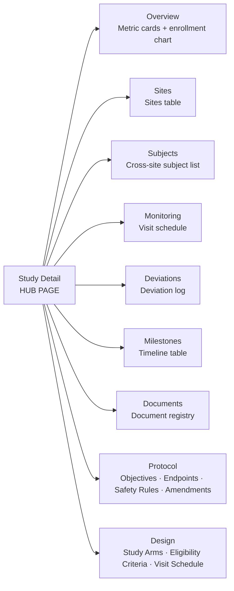

### Protocol Data Model

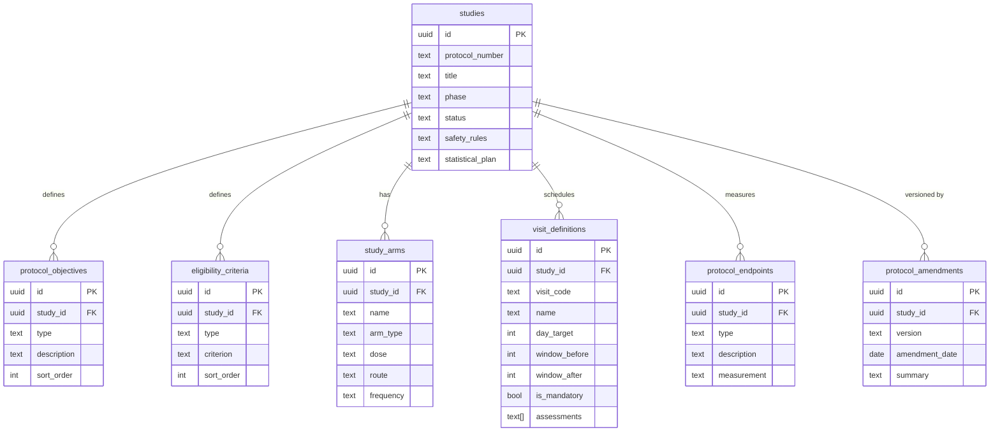

### Data flow

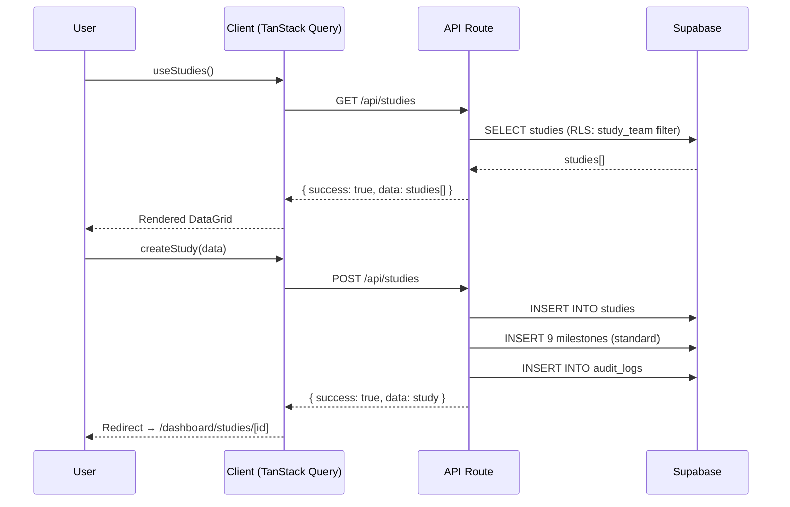

### Study status badge colors

```typescript
const studyStatusColors = {
  setup:      "bg-gray-100 text-gray-700",
  active:     "bg-green-100 text-green-700",
  on_hold:    "bg-yellow-100 text-yellow-700",
  completed:  "bg-blue-100 text-blue-700",
  terminated: "bg-red-100 text-red-700",
};
```

### 9 Standard milestones (auto-created on POST /api/studies)

```typescript
const STANDARD_MILESTONES = [
  "Protocol Finalized",
  "IRB/Ethics Approval Received",
  "First Site Initiated (FSI)",
  "First Patient In (FPI)",
  "Last Patient In (LPI)",
  "Last Patient Out (LPO)",
  "Database Lock",
  "Primary Analysis Complete",
  "Clinical Study Report Submitted",
];
```

---

## Sprint 2 — Sites Module

**Duration:** 75 min | **AI-executable**

### Files to create

```
src/app/api/sites/route.ts              GET ?study_id= + POST
src/app/api/sites/[id]/route.ts         GET + PUT
src/app/dashboard/studies/[id]/sites/page.tsx
src/app/dashboard/studies/[id]/sites/new/page.tsx
src/app/dashboard/studies/[id]/sites/[siteId]/page.tsx
src/hooks/use-sites.ts
src/types/schemas/site.ts
src/components/ctms/sites/sites-table.tsx
src/components/ctms/sites/site-form.tsx
src/components/ctms/sites/site-status-badge.tsx
src/components/ctms/sites/site-status-stepper.tsx
src/components/ctms/sites/enrollment-gauge.tsx
```

### Site status pipeline (stepper component)

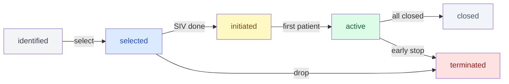

---

## Sprint 3 — Subject Enrollment

**Duration:** 75 min | **AI-executable**

### Files to create

```
src/app/api/subjects/route.ts
src/app/api/subjects/[id]/route.ts
src/app/dashboard/studies/[id]/sites/[siteId]/subjects/new/page.tsx
src/hooks/use-subjects.ts
src/types/schemas/subject.ts
src/components/ctms/subjects/subjects-table.tsx
src/components/ctms/subjects/enroll-subject-form.tsx
src/components/ctms/subjects/subject-status-badge.tsx
src/components/ctms/subjects/enrollment-summary-cards.tsx
src/components/ctms/subjects/enrollment-progress-bar.tsx
```

### Subject lifecycle

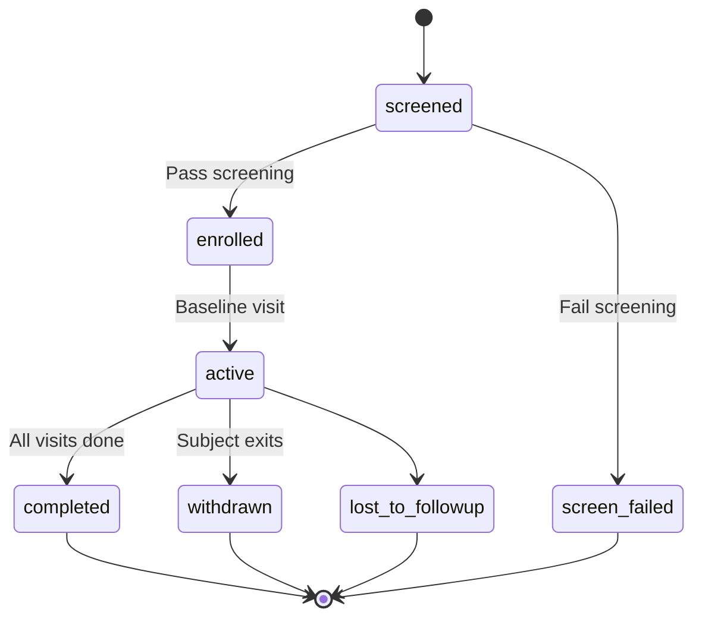

**Privacy rule:** Store `subject_number` (e.g., `001-003`) + `initials` (e.g., `J.D.`) only. No full names, DOB, or contact info.

---

## Sprint 4 — Monitoring Visits

**Duration:** 60 min | **AI-executable**

### Files to create

```
src/app/api/monitoring-visits/route.ts
src/app/api/monitoring-visits/[id]/route.ts
src/app/dashboard/monitoring/page.tsx    Monitor's personal queue
src/hooks/use-monitoring-visits.ts
src/types/schemas/monitoring-visit.ts
src/components/ctms/monitoring/monitoring-visits-table.tsx
src/components/ctms/monitoring/schedule-visit-form.tsx
src/components/ctms/monitoring/complete-visit-form.tsx
src/components/ctms/monitoring/visit-type-badge.tsx
```

### Visit completion flow

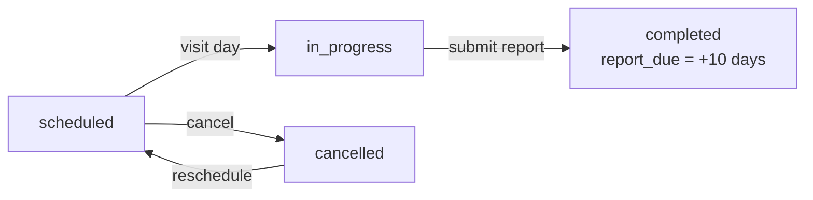

**Overdue:** `status = 'scheduled' AND planned_date < today` → red flag in UI.

---

## Sprint 5 — Deviations

**Duration:** 60 min | **AI-executable**

### Files to create

```
src/app/api/deviations/route.ts
src/app/api/deviations/[id]/route.ts
src/hooks/use-deviations.ts
src/types/schemas/deviation.ts
src/components/ctms/deviations/deviations-table.tsx
src/components/ctms/deviations/log-deviation-form.tsx
src/components/ctms/deviations/resolve-deviation-form.tsx
src/components/ctms/deviations/deviation-severity-badge.tsx
src/components/ctms/deviations/deviation-summary-cards.tsx
```

### Deviation number pattern

`DEV-{protocol_number}-{YYYY}-{seq:03d}` e.g. `DEV-PROTO-2026-001-007`

### Severity colors

```typescript
const severityColors = {
  minor:    "bg-yellow-100 text-yellow-700",
  major:    "bg-orange-100 text-orange-700",
  critical: "bg-red-100 text-red-700 font-semibold",
};
```

---

## Sprint 6 — Milestones

**Duration:** 45 min | **AI-executable**

### Files to create

```
src/app/api/milestones/route.ts
src/app/api/milestones/[id]/route.ts
src/hooks/use-milestones.ts
src/types/schemas/milestone.ts
src/components/ctms/milestones/milestones-table.tsx
src/components/ctms/milestones/milestone-status-badge.tsx
src/components/ctms/milestones/milestone-variance-badge.tsx
```

### Auto-status logic (client-side)

```typescript
import { isBefore, differenceInDays, parseISO } from 'date-fns';

function computeMilestoneStatus(m: Milestone) {
  if (m.actual_date) return 'completed';
  if (!m.planned_date) return 'pending';
  const planned = parseISO(m.planned_date);
  const today = new Date();
  if (isBefore(planned, today)) return 'missed';
  if (differenceInDays(planned, today) <= 14) return 'at_risk';
  return 'pending';
}
```

---

## Sprint 7 — Portfolio Dashboard

**Duration:** 60 min | **AI-executable**

### Files to create

```
src/app/dashboard/page.tsx              Replace generic dashboard
src/hooks/use-dashboard-metrics.ts
src/components/ctms/dashboard/metric-cards.tsx
src/components/ctms/dashboard/enrollment-table.tsx
src/components/ctms/dashboard/upcoming-visits-list.tsx
src/components/ctms/dashboard/deviations-summary.tsx
src/components/ctms/dashboard/recent-activity-feed.tsx
```

### Dashboard layout

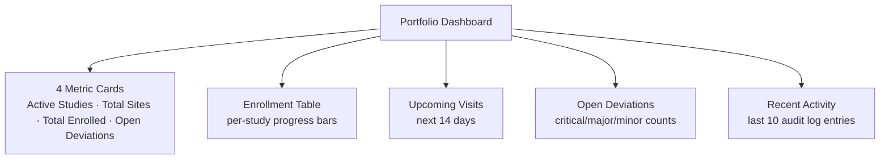

### Role-based views

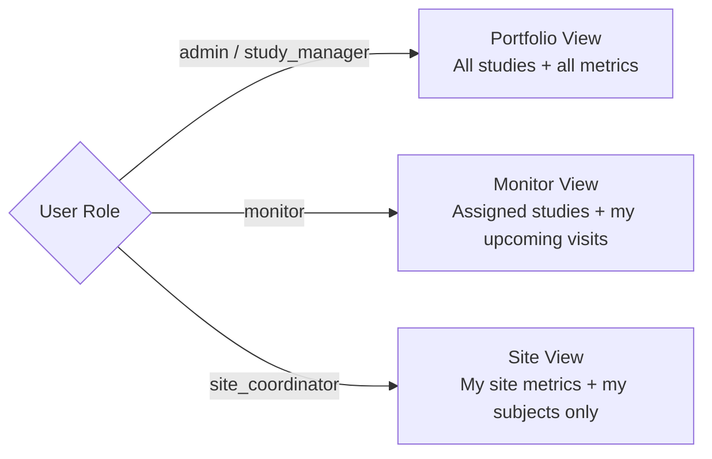

---

## Sprint 8 — Navigation & Polish

**Duration:** 30 min | **AI-executable**

### What to do

1. Update `src/config/nav.ts` — add all CTMS nav items with role visibility
2. Update `src/config/breadcrumbs.ts` — all new route patterns
3. Update `src/types/database.ts` — all 9 new TypeScript interfaces
4. Update `src/constants/query-keys.ts` — CTMS query keys
5. Add loading skeletons for studies/sites/subjects lists

### Final sidebar

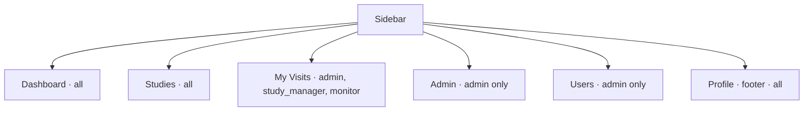

---

## Audit Log Helper — Create Once, Import Everywhere

```typescript
// src/lib/audit.ts
import type { SupabaseClient } from '@supabase/supabase-js';

export async function insertAuditLog(
  supabase: SupabaseClient,
  entry: {
    tableName: string;
    recordId: string;
    action: 'INSERT' | 'UPDATE' | 'DELETE';
    oldData?: Record<string, unknown>;
    newData?: Record<string, unknown>;
    performedBy: string;
  }
): Promise<void> {
  await supabase.from('audit_logs').insert({
    table_name: entry.tableName,
    record_id: entry.recordId,
    action: entry.action,
    old_data: entry.oldData ?? null,
    new_data: entry.newData ?? null,
    performed_by: entry.performedBy,
  });
  // Fire-and-forget: audit failure must NOT block the main operation
}
```

---

---

# DAY 2 — Compliance + Object Storage

---

## Sprint 9 — Document Upload with MinIO / S3

**Duration:** 2 hours | **AI-executable**

### Prerequisites: Start MinIO

```bash
docker compose up -d
# MinIO console → http://localhost:9001  (minioadmin / minioadmin123)
# S3 API        → http://localhost:9000
# Buckets auto-created: ctms-documents, ctms-signatures
```

### Install S3 SDK

```bash
npm install @aws-sdk/client-s3 @aws-sdk/s3-request-presigner
```

### Architecture

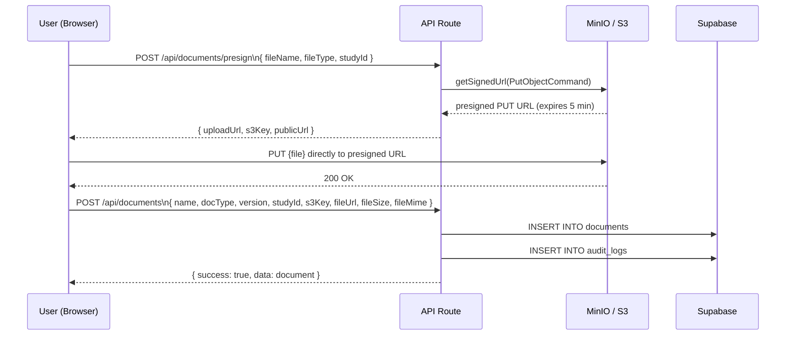

### Files to create

```
src/lib/s3.ts                            S3 client (MinIO-compatible)
src/app/api/documents/route.ts           GET + POST (metadata)
src/app/api/documents/[id]/route.ts      GET + PUT + DELETE
src/app/api/documents/presign/route.ts   GET presigned upload URL
src/app/api/documents/download/[id]/route.ts  GET presigned download URL
src/hooks/use-documents.ts
src/types/schemas/document.ts
src/components/ctms/documents/documents-table.tsx
src/components/ctms/documents/upload-document-form.tsx
src/components/ctms/documents/document-version-badge.tsx
src/components/ctms/documents/document-status-badge.tsx
```

### S3 client (`src/lib/s3.ts`)

```typescript
import { S3Client } from '@aws-sdk/client-s3';

export const s3Client = new S3Client({
  endpoint: process.env.S3_ENDPOINT,          // http://localhost:9000 for MinIO
  region: process.env.S3_REGION ?? 'us-east-1',
  credentials: {
    accessKeyId: process.env.S3_ACCESS_KEY_ID!,
    secretAccessKey: process.env.S3_SECRET_ACCESS_KEY!,
  },
  forcePathStyle: true, // required for MinIO
});

export const S3_BUCKET = process.env.S3_BUCKET_NAME ?? 'ctms-documents';
```

### S3 key naming convention

```
{study_id}/{doc_type}/{timestamp}_{originalFileName}
e.g: 550e8400-e29b-41d4-a716-446655440000/protocol/1710000000000_protocol_v2.pdf
```

### Document version control flow

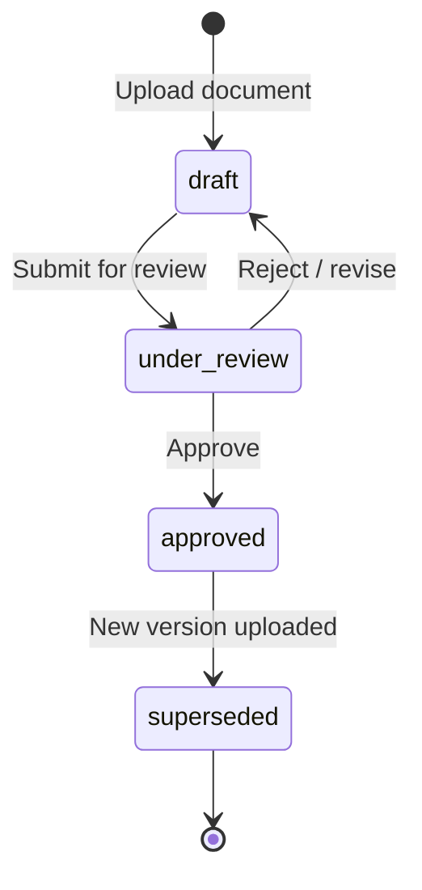

When a new version of a document is uploaded:
1. Set old document `status = 'superseded'`
2. Increment version number (`1.0 → 2.0`)
3. Insert new document record with new `s3_key`

### Additional DB migration (run with Sprint 9)

The `documents` table already has `file_url`, `file_size`, `file_mime`, `s3_key` columns from Sprint 0 migration. No additional migration needed.

---

## Sprint 10 — Electronic Signatures (Basic Approval Workflows)

**Duration:** 2 hours | **AI-executable**

### Overview

Implements signature capture for document approvals and deviation closures. Day 2 scope = credential re-confirmation + signed approval record. Full 21 CFR Part 11 audit-compliant signatures in Sprint 19.

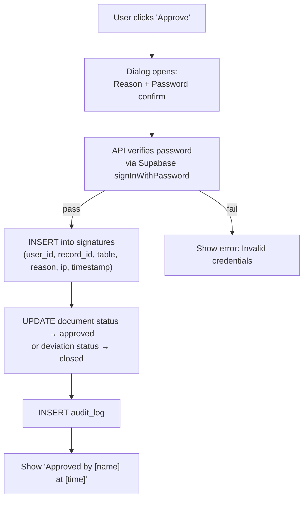

### Additional DB migration for Sprint 10

```sql
-- supabase/migrations/20260315000001_signatures.sql
CREATE TABLE public.signatures (
  id          uuid PRIMARY KEY DEFAULT gen_random_uuid(),
  table_name  text NOT NULL,       -- 'documents' | 'deviations' | 'monitoring_visits'
  record_id   uuid NOT NULL,
  signed_by   uuid NOT NULL REFERENCES auth.users(id),
  reason      text NOT NULL,
  meaning     text NOT NULL,       -- e.g. 'Approved', 'Reviewed', 'Rejected'
  ip_address  text,
  user_agent  text,
  signed_at   timestamptz NOT NULL DEFAULT now()
);
CREATE INDEX idx_signatures_record ON public.signatures(table_name, record_id);
ALTER TABLE public.signatures ENABLE ROW LEVEL SECURITY;
CREATE POLICY "Admins view all signatures" ON public.signatures FOR SELECT TO authenticated
  USING (EXISTS (SELECT 1 FROM public.profiles WHERE id = auth.uid() AND role = 'admin'));
CREATE POLICY "Users view own signatures" ON public.signatures FOR SELECT TO authenticated
  USING (signed_by = auth.uid());
CREATE POLICY "Authenticated users can sign" ON public.signatures FOR INSERT TO authenticated
  WITH CHECK (signed_by = auth.uid());
```

### Files to create

```
src/app/api/signatures/route.ts              POST (create signature + verify password)
src/app/api/signatures/[recordId]/route.ts   GET (fetch signatures for a record)
src/hooks/use-signatures.ts
src/components/ctms/signatures/sign-dialog.tsx        Credential re-confirm modal
src/components/ctms/signatures/signature-display.tsx  "Signed by X at Y" component
src/components/ctms/signatures/signatures-list.tsx    List of all signatures on a record
```

---

## Sprint 11 — Email Notifications

**Duration:** 1 hour | **AI-executable**

### Install

```bash
npm install resend
```

### Notification triggers

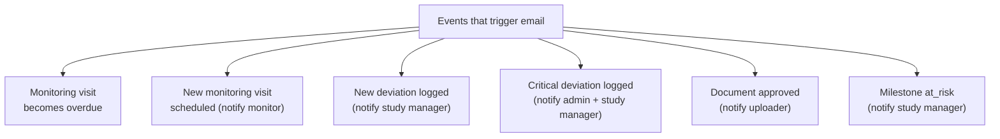

### Files to create

```
src/lib/email.ts                           Resend client + send helper
src/lib/email-templates/                   HTML email templates (one per event type)
  deviation-logged.tsx
  visit-overdue.tsx
  document-approved.tsx
  milestone-at-risk.tsx
src/app/api/notifications/route.ts         GET in-app notification list
```

### Additional DB migration for Sprint 11

```sql
-- supabase/migrations/20260315000002_notifications.sql
CREATE TABLE public.notifications (
  id         uuid PRIMARY KEY DEFAULT gen_random_uuid(),
  user_id    uuid NOT NULL REFERENCES auth.users(id) ON DELETE CASCADE,
  title      text NOT NULL,
  body       text,
  type       text NOT NULL CHECK (type IN ('deviation','visit','document','milestone','general')),
  read       boolean NOT NULL DEFAULT false,
  link_url   text,
  created_at timestamptz NOT NULL DEFAULT now()
);
CREATE INDEX idx_notifications_user_id ON public.notifications(user_id, read);
ALTER TABLE public.notifications ENABLE ROW LEVEL SECURITY;
CREATE POLICY "Users see own notifications" ON public.notifications FOR ALL TO authenticated
  USING (user_id = auth.uid());
```

---

## Sprint 12 — Audit Log Viewer UI + Study Team Management

**Duration:** 90 min | **AI-executable**

### Audit Log Viewer

```
src/app/admin/audit-logs/page.tsx
src/components/admin/audit-log-table.tsx
```

- Admin-only page at `/admin/audit-logs`
- Filterable by: table_name, action, date range, user
- Shows: timestamp, user name, table, action (INSERT/UPDATE/DELETE), record ID, diff view (old vs new data as JSON)

### Study Team Management

```
src/app/dashboard/studies/[id]/team/page.tsx
src/app/api/study-team/route.ts              GET + POST
src/app/api/study-team/[id]/route.ts         DELETE
src/hooks/use-study-team.ts
src/components/ctms/team/team-members-table.tsx
src/components/ctms/team/add-team-member-form.tsx
```

### Team management flow

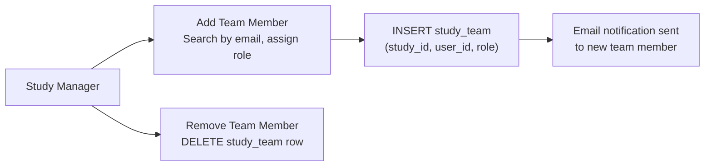

---

---

# WEEK 1 — Operations Layer (Days 3–5)

---

## Sprint 13 — Budget & Financial Management

**Duration:** 2 days | **AI-executable**

### Overview

Tracks study budgets, per-visit payments to sites, and cost forecasting.

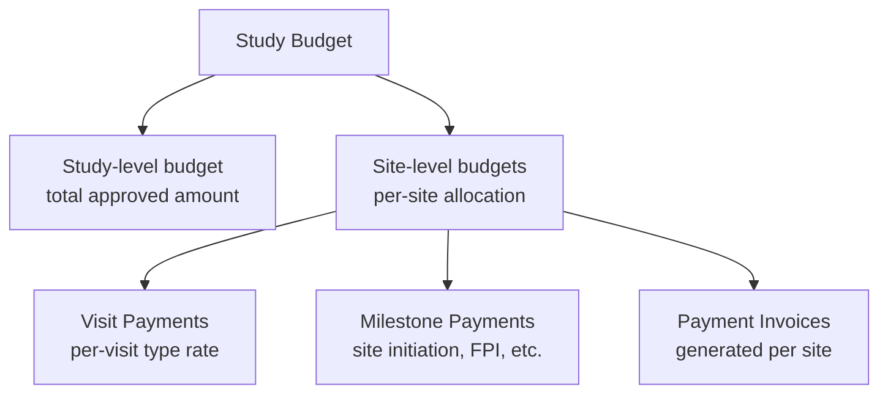

### Additional DB migration for Sprint 13

```sql
-- supabase/migrations/20260316000001_budget.sql
CREATE TABLE public.study_budgets (
  id                  uuid PRIMARY KEY DEFAULT gen_random_uuid(),
  study_id            uuid NOT NULL REFERENCES public.studies(id) ON DELETE CASCADE,
  total_approved      numeric(14,2) NOT NULL DEFAULT 0,
  currency            text NOT NULL DEFAULT 'USD',
  fiscal_year         integer,
  notes               text,
  created_by          uuid REFERENCES auth.users(id),
  created_at          timestamptz NOT NULL DEFAULT now(),
  updated_at          timestamptz NOT NULL DEFAULT now(),
  UNIQUE(study_id)
);

CREATE TABLE public.site_budgets (
  id                  uuid PRIMARY KEY DEFAULT gen_random_uuid(),
  study_id            uuid NOT NULL REFERENCES public.studies(id) ON DELETE CASCADE,
  site_id             uuid NOT NULL REFERENCES public.sites(id) ON DELETE CASCADE,
  allocated_amount    numeric(14,2) NOT NULL DEFAULT 0,
  spent_amount        numeric(14,2) NOT NULL DEFAULT 0,
  currency            text NOT NULL DEFAULT 'USD',
  created_at          timestamptz NOT NULL DEFAULT now(),
  updated_at          timestamptz NOT NULL DEFAULT now(),
  UNIQUE(study_id, site_id)
);

CREATE TABLE public.payment_schedules (
  id              uuid PRIMARY KEY DEFAULT gen_random_uuid(),
  site_budget_id  uuid NOT NULL REFERENCES public.site_budgets(id) ON DELETE CASCADE,
  milestone_name  text NOT NULL,  -- 'Site Initiation', 'Per Subject Enrolled', 'Per Visit IMV', etc.
  payment_type    text NOT NULL CHECK (payment_type IN ('milestone','per_subject','per_visit','overhead')),
  amount          numeric(12,2) NOT NULL,
  created_at      timestamptz NOT NULL DEFAULT now()
);

CREATE TABLE public.payment_records (
  id              uuid PRIMARY KEY DEFAULT gen_random_uuid(),
  site_id         uuid NOT NULL REFERENCES public.sites(id) ON DELETE CASCADE,
  study_id        uuid NOT NULL REFERENCES public.studies(id) ON DELETE CASCADE,
  schedule_id     uuid REFERENCES public.payment_schedules(id),
  amount          numeric(12,2) NOT NULL,
  status          text NOT NULL DEFAULT 'pending' CHECK (status IN ('pending','approved','paid','disputed')),
  description     text,
  due_date        date,
  paid_date       date,
  invoice_number  text,
  created_by      uuid REFERENCES auth.users(id),
  created_at      timestamptz NOT NULL DEFAULT now(),
  updated_at      timestamptz NOT NULL DEFAULT now()
);
```

### Files to create

```
src/app/api/study-budgets/route.ts
src/app/api/site-budgets/route.ts
src/app/api/payment-records/route.ts
src/app/dashboard/studies/[id]/budget/page.tsx
src/hooks/use-budget.ts
src/components/ctms/budget/study-budget-overview.tsx   Total allocated vs spent
src/components/ctms/budget/site-budget-table.tsx       Per-site breakdown
src/components/ctms/budget/payment-records-table.tsx   Payment history
src/components/ctms/budget/budget-burn-chart.tsx       Spend over time (CSS bar chart)
```

### Budget flow

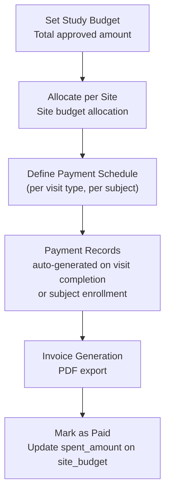

---

## Sprint 14 — Site Performance Scorecards

**Duration:** 1 day | **AI-executable**

### Overview

Automated site performance metrics — enrollment rate, data quality, visit compliance, deviation rate — rendered as a scorecard per site.

### Additional DB migration for Sprint 14

```sql
-- supabase/migrations/20260317000001_site_performance.sql
CREATE TABLE public.site_performance_snapshots (
  id                    uuid PRIMARY KEY DEFAULT gen_random_uuid(),
  site_id               uuid NOT NULL REFERENCES public.sites(id) ON DELETE CASCADE,
  study_id              uuid NOT NULL REFERENCES public.studies(id) ON DELETE CASCADE,
  snapshot_date         date NOT NULL DEFAULT CURRENT_DATE,
  enrollment_rate       numeric(5,2),   -- % of target enrolled
  screen_failure_rate   numeric(5,2),   -- screen_failures / total screened * 100
  visit_compliance_rate numeric(5,2),   -- completed visits on time / scheduled
  deviation_rate        numeric(5,2),   -- deviations per subject
  overall_score         numeric(5,2),   -- weighted composite 0-100
  created_at            timestamptz NOT NULL DEFAULT now()
);
CREATE INDEX idx_perf_site_date ON public.site_performance_snapshots(site_id, snapshot_date);
```

### Files to create

```
src/app/api/site-performance/route.ts           GET snapshots + POST (recalculate)
src/app/dashboard/studies/[id]/performance/page.tsx
src/hooks/use-site-performance.ts
src/components/ctms/performance/site-scorecard.tsx     Score + breakdown bars
src/components/ctms/performance/performance-table.tsx  Ranked site comparison
src/components/ctms/performance/score-badge.tsx        A/B/C/D/F grade badge
```

### Scorecard calculation (server-side, API route)

```typescript
// Weights
const ENROLLMENT_WEIGHT   = 0.35;
const VISIT_COMPLIANCE    = 0.30;
const DEVIATION_RATE      = 0.20;
const SCREEN_FAILURE_RATE = 0.15;

function calculateOverallScore(site: SiteWithMetrics): number {
  const enrollScore    = Math.min(100, (site.enrolled_count / (site.target_enrollment || 1)) * 100);
  const visitScore     = site.visit_compliance_rate ?? 0;
  const deviationScore = Math.max(0, 100 - (site.deviation_rate ?? 0) * 20);
  const sfScore        = Math.max(0, 100 - (site.screen_failure_rate ?? 0));
  return (
    enrollScore    * ENROLLMENT_WEIGHT +
    visitScore     * VISIT_COMPLIANCE  +
    deviationScore * DEVIATION_RATE    +
    sfScore        * SCREEN_FAILURE_RATE
  );
}
```

---

## Sprint 15 — Communication Center

**Duration:** 1 day | **AI-executable**

### Overview

In-app messaging between study team members, announcement broadcasts, and notification center.

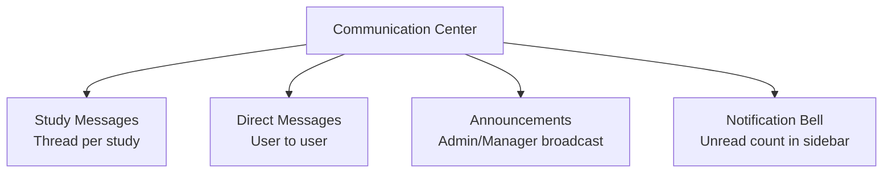

### Additional DB migration for Sprint 15

```sql
-- supabase/migrations/20260318000001_messages.sql
CREATE TABLE public.messages (
  id          uuid PRIMARY KEY DEFAULT gen_random_uuid(),
  study_id    uuid REFERENCES public.studies(id) ON DELETE CASCADE,
  sender_id   uuid NOT NULL REFERENCES auth.users(id),
  recipient_id uuid REFERENCES auth.users(id),  -- null = study-wide broadcast
  body        text NOT NULL,
  type        text NOT NULL DEFAULT 'message' CHECK (type IN ('message','announcement')),
  read_by     uuid[] NOT NULL DEFAULT '{}',
  created_at  timestamptz NOT NULL DEFAULT now()
);
CREATE INDEX idx_messages_study ON public.messages(study_id);
CREATE INDEX idx_messages_recipient ON public.messages(recipient_id);
ALTER TABLE public.messages ENABLE ROW LEVEL SECURITY;
CREATE POLICY "Study team members can view study messages" ON public.messages FOR SELECT TO authenticated
  USING (
    (study_id IS NULL AND recipient_id = auth.uid()) OR
    EXISTS (SELECT 1 FROM public.study_team WHERE study_id = messages.study_id AND user_id = auth.uid()) OR
    EXISTS (SELECT 1 FROM public.profiles WHERE id = auth.uid() AND role = 'admin')
  );
CREATE POLICY "Team members can send messages" ON public.messages FOR INSERT TO authenticated
  WITH CHECK (sender_id = auth.uid());
```

### Files to create

```
src/app/api/messages/route.ts
src/app/dashboard/studies/[id]/messages/page.tsx
src/app/dashboard/messages/page.tsx              Global message inbox
src/hooks/use-messages.ts
src/components/ctms/messages/message-thread.tsx
src/components/ctms/messages/compose-message-form.tsx
src/components/ctms/messages/notification-bell.tsx     Unread count badge
src/components/ctms/messages/notification-dropdown.tsx
```

---

## Sprint 16 — Study Startup Optimization + Multi-Study Portfolio View

**Duration:** 1 day | **AI-executable**

### Study Startup Checklist

Tracks required tasks for site activation — IRB submission, contract execution, regulatory approvals.

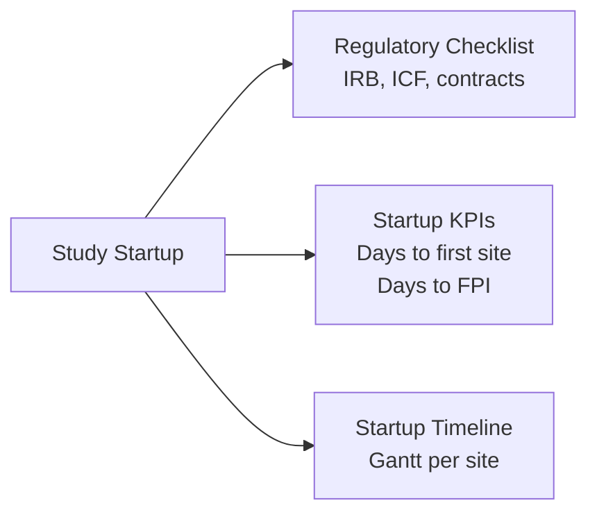

### Portfolio View

A high-level view across all studies for executive reporting.

```
src/app/dashboard/portfolio/page.tsx
src/components/ctms/portfolio/portfolio-overview.tsx   All studies, enrollment heat map
src/components/ctms/portfolio/resource-allocation.tsx  Monitor assignments across studies
src/components/ctms/portfolio/study-comparison.tsx     Side-by-side study metrics
```

---

---

# WEEK 2 — Integrations + Advanced Compliance (Days 6–10)

---

## Sprint 17 — EDC Integration (REDCap API)

**Duration:** 2 days | **AI-executable**

### Overview

Connects to an external Electronic Data Capture system to pull subject visit data without re-entry.

```mermaid
sequenceDiagram
    participant CTMS
    participant REDCap as REDCap API
    participant DB as Supabase

    CTMS->>REDCap: GET /api/?token=&content=record&format=json
    REDCap-->>CTMS: Subject records JSON
    CTMS->>CTMS: Map REDCap fields → CTMS subjects + visits
    CTMS->>DB: UPSERT subjects (update status if changed)
    CTMS->>DB: INSERT audit_log (source: 'edc_sync')
    CTMS-->>User: "Sync complete: 12 records updated"
```

### Additional DB migration for Sprint 17

```sql
-- supabase/migrations/20260323000001_integrations.sql
CREATE TABLE public.edc_connections (
  id          uuid PRIMARY KEY DEFAULT gen_random_uuid(),
  study_id    uuid NOT NULL REFERENCES public.studies(id) ON DELETE CASCADE,
  edc_type    text NOT NULL CHECK (edc_type IN ('redcap','medidata','oracle_clinical_one','other')),
  api_url     text NOT NULL,
  api_token   text NOT NULL,   -- store encrypted in production
  project_id  text,
  last_sync   timestamptz,
  sync_status text DEFAULT 'idle' CHECK (sync_status IN ('idle','running','success','error')),
  created_at  timestamptz NOT NULL DEFAULT now(),
  UNIQUE(study_id)
);

CREATE TABLE public.edc_sync_logs (
  id           uuid PRIMARY KEY DEFAULT gen_random_uuid(),
  study_id     uuid NOT NULL REFERENCES public.studies(id) ON DELETE CASCADE,
  records_synced integer DEFAULT 0,
  errors       jsonb,
  started_at   timestamptz NOT NULL DEFAULT now(),
  completed_at timestamptz
);
```

### Files to create

```
src/lib/edc/redcap.ts              REDCap API client
src/lib/edc/field-mapper.ts        REDCap fields → CTMS subject fields
src/app/api/integrations/edc/sync/route.ts   POST trigger sync
src/app/api/integrations/edc/route.ts        GET + POST connection config
src/app/dashboard/studies/[id]/integrations/page.tsx
src/components/ctms/integrations/edc-connection-form.tsx
src/components/ctms/integrations/sync-status-badge.tsx
src/components/ctms/integrations/sync-log-table.tsx
```

---

## Sprint 18 — Supply Chain / IMP Tracking

**Duration:** 2 days | **AI-executable**

### Overview

Tracks Investigational Medicinal Product (IMP) shipments, site inventory, and expiry monitoring.

```mermaid
graph TD
    IMP["IMP / Drug Supply"] --> SHP["Shipments\nFrom depot to site"]
    IMP --> INV["Site Inventory\nCurrent stock levels"]
    IMP --> EXP["Expiry Tracking\nAlerts for expiring batches"]
    IMP --> REC["Reconciliation\nDispensed vs returned vs destroyed"]
```

### Additional DB migration for Sprint 18

```sql
-- supabase/migrations/20260324000001_supply_chain.sql
CREATE TABLE public.imp_batches (
  id          uuid PRIMARY KEY DEFAULT gen_random_uuid(),
  study_id    uuid NOT NULL REFERENCES public.studies(id) ON DELETE CASCADE,
  batch_number text NOT NULL,
  product_name text NOT NULL,
  quantity    integer NOT NULL,
  unit        text NOT NULL DEFAULT 'units',
  expiry_date date NOT NULL,
  status      text NOT NULL DEFAULT 'available' CHECK (status IN ('available','shipped','received','dispensed','returned','destroyed')),
  created_at  timestamptz NOT NULL DEFAULT now()
);

CREATE TABLE public.imp_shipments (
  id            uuid PRIMARY KEY DEFAULT gen_random_uuid(),
  study_id      uuid NOT NULL REFERENCES public.studies(id) ON DELETE CASCADE,
  site_id       uuid NOT NULL REFERENCES public.sites(id) ON DELETE CASCADE,
  batch_id      uuid NOT NULL REFERENCES public.imp_batches(id),
  quantity      integer NOT NULL,
  shipped_date  date,
  received_date date,
  status        text NOT NULL DEFAULT 'pending' CHECK (status IN ('pending','in_transit','received','discrepancy')),
  tracking_number text,
  notes         text,
  created_at    timestamptz NOT NULL DEFAULT now()
);

CREATE TABLE public.imp_site_inventory (
  id          uuid PRIMARY KEY DEFAULT gen_random_uuid(),
  site_id     uuid NOT NULL REFERENCES public.sites(id) ON DELETE CASCADE,
  batch_id    uuid NOT NULL REFERENCES public.imp_batches(id),
  received    integer NOT NULL DEFAULT 0,
  dispensed   integer NOT NULL DEFAULT 0,
  returned    integer NOT NULL DEFAULT 0,
  destroyed   integer NOT NULL DEFAULT 0,
  updated_at  timestamptz NOT NULL DEFAULT now(),
  UNIQUE(site_id, batch_id)
);
```

### Files to create

```
src/app/api/imp-batches/route.ts
src/app/api/imp-shipments/route.ts
src/app/api/imp-inventory/route.ts
src/app/dashboard/studies/[id]/supply-chain/page.tsx
src/components/ctms/supply-chain/shipments-table.tsx
src/components/ctms/supply-chain/inventory-gauge.tsx
src/components/ctms/supply-chain/expiry-alert-banner.tsx
```

---

## Sprint 19 — Full 21 CFR Part 11 Electronic Signatures

**Duration:** 1 day | **AI-executable**

### What this adds on top of Sprint 10

Sprint 10 gave us credential re-confirmation + signature records. Sprint 19 makes this fully CFR-compliant:

```mermaid
graph TD
    S10["Sprint 10 Basic\nPassword re-confirm + DB record"] --> S19["Sprint 19 Full CFR"]
    S19 --> HL["Handwritten-equivalent\nSignature appearance (typed name)"]
    S19 --> SB["Signature binding\nRecord cannot be modified after signing"]
    S19 --> SR["Signature report\nAll signatures printable per document"]
    S19 --> MSW["Multi-step workflow\nReview → Approve → QA Verify"]
    S19 --> TST["Timestamp server\nCryptographic timestamp per signature"]
```

### Additional changes

- Add `locked = true` column to `documents` and `deviations` — locked records cannot be edited after final signature
- Signature report endpoint: `GET /api/signatures/report?table=documents&record_id=` returns all signatures as printable HTML
- Add `signature_required_for` column to `documents.status` transitions — enforce signature before advancing state

---

## Sprint 20 — Global Regulatory Compliance Framework

**Duration:** 1 day | **AI-executable**

### Overview

Country-specific regulatory tracking, submission status, and ICH-GCP compliance checklist per site.

```mermaid
graph LR
    REG["Regulatory Compliance"] --> CS["Country Submissions\nIRB, competent authority per country"]
    REG["Regulatory Compliance"] --> GCP["GCP Checklist\nper site, per study"]
    REG["Regulatory Compliance"] --> IND["IND/CTA Status\nFDA IND, EMA CTA tracking"]
```

### Additional DB migration for Sprint 20

```sql
-- supabase/migrations/20260325000001_regulatory.sql
CREATE TABLE public.regulatory_submissions (
  id               uuid PRIMARY KEY DEFAULT gen_random_uuid(),
  study_id         uuid NOT NULL REFERENCES public.studies(id) ON DELETE CASCADE,
  site_id          uuid REFERENCES public.sites(id),
  submission_type  text NOT NULL CHECK (submission_type IN ('IND','CTA','IRB','Ethics_Committee','Competent_Authority','Other')),
  country          text NOT NULL,
  authority_name   text,
  submission_date  date,
  approval_date    date,
  expiry_date      date,
  reference_number text,
  status           text NOT NULL DEFAULT 'pending' CHECK (status IN ('not_submitted','pending','approved','rejected','expired','amendment_required')),
  document_id      uuid REFERENCES public.documents(id),
  notes            text,
  created_at       timestamptz NOT NULL DEFAULT now(),
  updated_at       timestamptz NOT NULL DEFAULT now()
);

CREATE TABLE public.gcp_checklist_items (
  id          uuid PRIMARY KEY DEFAULT gen_random_uuid(),
  site_id     uuid NOT NULL REFERENCES public.sites(id) ON DELETE CASCADE,
  study_id    uuid NOT NULL REFERENCES public.studies(id) ON DELETE CASCADE,
  category    text NOT NULL,    -- 'Training', 'Facilities', 'Documentation', 'ICF', 'IMP'
  item        text NOT NULL,
  status      text NOT NULL DEFAULT 'pending' CHECK (status IN ('pending','compliant','non_compliant','na')),
  notes       text,
  verified_by uuid REFERENCES auth.users(id),
  verified_at timestamptz,
  created_at  timestamptz NOT NULL DEFAULT now()
);
```

### Files to create

```
src/app/api/regulatory-submissions/route.ts
src/app/api/gcp-checklist/route.ts
src/app/dashboard/studies/[id]/regulatory/page.tsx
src/components/ctms/regulatory/submissions-table.tsx
src/components/ctms/regulatory/gcp-checklist.tsx
src/components/ctms/regulatory/country-status-map.tsx   Visual: countries with status badges
```

---

## Sprint 21 — Custom Form Builder (No-Code)

**Duration:** 1 day | **AI-executable**

### Overview

Drag-and-drop (or sequential add) form builder for custom data collection — visit-specific eCRF pages, site qualification questionnaires, protocol-specific assessments.

```mermaid
graph TD
    FB["Form Builder"] --> FD["Form Definition\n(schema stored as JSON)"]
    FB --> FP["Form Preview\nlive render of JSON schema"]
    FD --> FR["Form Responses\nstored per subject/site"]
    FR --> FE["Form Export\nCSV / JSON download"]
```

### Additional DB migration for Sprint 21

```sql
-- supabase/migrations/20260327000001_custom_forms.sql
CREATE TABLE public.form_definitions (
  id          uuid PRIMARY KEY DEFAULT gen_random_uuid(),
  study_id    uuid NOT NULL REFERENCES public.studies(id) ON DELETE CASCADE,
  name        text NOT NULL,
  description text,
  form_type   text NOT NULL CHECK (form_type IN ('visit_form','site_qualification','subject_screening','adverse_event','other')),
  schema      jsonb NOT NULL DEFAULT '{"fields": []}',  -- field definitions
  version     integer NOT NULL DEFAULT 1,
  is_active   boolean NOT NULL DEFAULT true,
  created_by  uuid REFERENCES auth.users(id),
  created_at  timestamptz NOT NULL DEFAULT now(),
  updated_at  timestamptz NOT NULL DEFAULT now()
);

CREATE TABLE public.form_responses (
  id             uuid PRIMARY KEY DEFAULT gen_random_uuid(),
  form_id        uuid NOT NULL REFERENCES public.form_definitions(id),
  study_id       uuid NOT NULL REFERENCES public.studies(id) ON DELETE CASCADE,
  site_id        uuid REFERENCES public.sites(id),
  subject_id     uuid REFERENCES public.subjects(id),
  responses      jsonb NOT NULL DEFAULT '{}',  -- { fieldId: value }
  status         text NOT NULL DEFAULT 'draft' CHECK (status IN ('draft','submitted','reviewed')),
  submitted_by   uuid REFERENCES auth.users(id),
  submitted_at   timestamptz,
  created_at     timestamptz NOT NULL DEFAULT now()
);
```

### Field types supported

| Type | Description |
|---|---|
| `text` | Single-line text input |
| `textarea` | Multi-line text |
| `number` | Numeric (with min/max) |
| `date` | Date picker |
| `select` | Dropdown (options array in schema) |
| `multiselect` | Checkbox group |
| `radio` | Radio buttons |
| `boolean` | Yes/No toggle |
| `scale` | Numeric scale (e.g., 1–10 pain scale) |

### Files to create

```
src/app/api/form-definitions/route.ts
src/app/api/form-responses/route.ts
src/app/dashboard/studies/[id]/forms/page.tsx
src/app/dashboard/studies/[id]/forms/new/page.tsx      Form builder UI
src/app/dashboard/studies/[id]/forms/[formId]/fill/page.tsx  Form fill UI
src/components/ctms/forms/form-builder.tsx             Visual builder
src/components/ctms/forms/form-field-editor.tsx        Add/edit field modal
src/components/ctms/forms/form-renderer.tsx            Renders JSON schema as real form
src/components/ctms/forms/form-responses-table.tsx     View submitted responses
```

---

---

# WEEK 3 — AI + Mobile (Days 11–15)

---

## Sprint 22 — eTMF Integration (Trial Master File)

**Duration:** 2 days | **AI-executable**

### Overview

Extends the document module to meet ICH-GCP eTMF (Electronic Trial Master File) requirements with proper filing structure (per TMF Reference Model).

```mermaid
graph TD
    eTMF["eTMF Module"] --> ZS["Zone Structure\nZone 1-3 per TMF Reference Model"]
    ZS --> Z1["Zone 1\nTrial Management"]
    ZS --> Z2["Zone 2\nIP & Pharmacy"]
    ZS --> Z3["Zone 3\nSite Management"]
    eTMF --> CI["Completeness Index\n% of required docs filed"]
    eTMF --> IH["Inspection Readiness\nHealthcheck per zone"]
```

### Additional DB migration for Sprint 22

```sql
-- supabase/migrations/20260330000001_etmf.sql
ALTER TABLE public.documents
  ADD COLUMN tmf_zone     text,
  ADD COLUMN tmf_section  text,
  ADD COLUMN tmf_artifact text,
  ADD COLUMN is_tmf_document boolean NOT NULL DEFAULT false;

CREATE TABLE public.tmf_required_documents (
  id          uuid PRIMARY KEY DEFAULT gen_random_uuid(),
  study_id    uuid NOT NULL REFERENCES public.studies(id) ON DELETE CASCADE,
  zone        text NOT NULL,
  section     text NOT NULL,
  artifact    text NOT NULL,
  is_required boolean NOT NULL DEFAULT true,
  has_filed   boolean NOT NULL DEFAULT false,
  document_id uuid REFERENCES public.documents(id),
  updated_at  timestamptz NOT NULL DEFAULT now()
);
```

### Files to create

```
src/app/api/tmf/route.ts                             TMF structure + completeness
src/app/dashboard/studies/[id]/tmf/page.tsx
src/components/ctms/tmf/tmf-zone-view.tsx            Zone/Section/Artifact tree
src/components/ctms/tmf/tmf-completeness-gauge.tsx   % complete per zone
src/components/ctms/tmf/inspection-readiness.tsx     Red/Amber/Green per zone
```

---

## Sprint 23 — Predictive Enrollment AI

**Duration:** 2 days | **AI-executable**

### Overview

Uses Claude API to analyze historical site enrollment data and predict: enrollment completion date, at-risk sites, recommended enrollment acceleration strategies.

```mermaid
sequenceDiagram
    participant U as User
    participant A as API Route
    participant DB as Supabase
    participant AI as Claude API

    U->>A: POST /api/ai/enrollment-forecast\n{ studyId }
    A->>DB: Fetch enrollment history, site rates, milestones
    A->>AI: Prompt with structured enrollment data
    AI-->>A: Forecast: completion date, at-risk sites, recommendations
    A->>DB: Store forecast in ai_predictions table
    A-->>U: { forecast, confidence, recommendations[] }
```

### Install

```bash
npm install @anthropic-ai/sdk
```

### Additional env variable

```
ANTHROPIC_API_KEY=sk-ant-xxxxxxxxxxxx
```

### Additional DB migration for Sprint 23

```sql
-- supabase/migrations/20260401000001_ai.sql
CREATE TABLE public.ai_predictions (
  id              uuid PRIMARY KEY DEFAULT gen_random_uuid(),
  study_id        uuid NOT NULL REFERENCES public.studies(id) ON DELETE CASCADE,
  prediction_type text NOT NULL CHECK (prediction_type IN ('enrollment_forecast','site_risk','deviation_risk','completion_date')),
  input_data      jsonb NOT NULL,
  output_data     jsonb NOT NULL,
  confidence      numeric(5,2),
  generated_at    timestamptz NOT NULL DEFAULT now(),
  model_used      text NOT NULL DEFAULT 'claude-sonnet-4-6'
);
```

### Files to create

```
src/lib/ai/claude.ts                           Anthropic SDK client
src/lib/ai/prompts/enrollment-forecast.ts      Structured prompt builder
src/lib/ai/prompts/site-risk.ts
src/app/api/ai/enrollment-forecast/route.ts
src/app/api/ai/site-risk/route.ts
src/app/dashboard/studies/[id]/ai-insights/page.tsx
src/components/ctms/ai/enrollment-forecast-card.tsx
src/components/ctms/ai/site-risk-list.tsx
src/components/ctms/ai/ai-recommendation-panel.tsx
```

### Claude prompt structure (enrollment forecast)

```typescript
const prompt = `
You are a clinical trial analytics expert. Analyze the enrollment data below and provide:
1. Predicted enrollment completion date (ISO date)
2. Confidence level (0-100)
3. Top 3 at-risk sites with specific reasons
4. 3 actionable recommendations to improve enrollment rate

Study: ${study.protocol_number} — ${study.title}
Phase: ${study.phase}
Target enrollment: ${study.target_enrollment}
Current date: ${today}

Site enrollment data:
${sitesData.map(s => `- Site ${s.site_number} (${s.country}): ${s.enrolled_count}/${s.target_enrollment} enrolled, activated ${s.initiated_date}`).join('\n')}

Monthly enrollment rates (last 6 months):
${monthlyRates.map(m => `${m.month}: ${m.count} subjects`).join('\n')}

Respond in JSON format: { predicted_date, confidence, at_risk_sites: [], recommendations: [] }
`;
```

---

## Sprint 24 — AI-Powered Site Selection

**Duration:** 1 day | **AI-executable**

### Overview

When adding new sites to a study, AI ranks candidate sites based on therapeutic area, historical performance, and geographic patient population.

### Files to create

```
src/app/api/ai/site-selection/route.ts
src/components/ctms/ai/site-selection-wizard.tsx   Multi-step: criteria → AI rank → confirm
src/lib/ai/prompts/site-selection.ts
```

### Site selection flow

```mermaid
flowchart TD
    SM["Study Manager"] --> CRIT["Enter criteria:\nTherapeutic area, country, target enrollment"]
    CRIT --> AI["Claude API:\nRank sites by historical performance + fit score"]
    AI --> RANK["Ranked site list with AI reasoning per site"]
    RANK --> SEL["Select sites to add to study"]
    SEL --> ADD["Add selected sites → study_team + sites table"]
```

---

## Sprint 25 — Advanced Analytics & Reporting

**Duration:** 1 day | **AI-executable**

### Overview

Comprehensive reporting module with exportable reports, cross-study benchmarking, and trend analysis.

```mermaid
graph TD
    AR["Advanced Analytics"] --> STU["Study-level reports\nEnrollment, deviations, visits"]
    AR --> CRO["Cross-study benchmarking\nCompare site performance"]
    AR --> TREND["Trend analysis\nEnrollment velocity over time"]
    AR --> EXP["Export engine\nCSV, PDF, JSON"]
    AR --> SCHED["Scheduled reports\nEmail on cadence"]
```

### Files to create

```
src/app/api/reports/enrollment/route.ts       Enrollment trend data
src/app/api/reports/deviations/route.ts       Deviation analytics
src/app/api/reports/sites/route.ts            Site comparison
src/app/api/reports/export/route.ts           CSV/JSON export
src/app/dashboard/reports/page.tsx
src/components/ctms/reports/enrollment-trend-chart.tsx
src/components/ctms/reports/site-comparison-table.tsx
src/components/ctms/reports/report-export-button.tsx
src/components/ctms/reports/deviation-heatmap.tsx
```

---

## Sprint 26 — Mobile PWA

**Duration:** 2 days | **AI-executable**

### Overview

Progressive Web App — installable on mobile devices, offline-capable for monitoring visit data entry. No React Native required.

```mermaid
graph TD
    PWA["PWA Strategy"] --> SW["Service Worker\nCache API responses"]
    PWA --> MAN["Web App Manifest\nInstallable on home screen"]
    PWA --> RES["Responsive layouts\nMobile-first on all pages"]
    PWA --> OFF["Offline queue\nMutations queued when offline, sync on reconnect"]
```

### Implementation steps

1. Add `next-pwa` package
2. Create `public/manifest.json` with app name, icons, theme color
3. Implement service worker via `next-pwa` for caching
4. Add offline mutation queue using TanStack Query `persistQueryClient`
5. Create mobile-optimized versions of the 3 highest-mobile-use screens:
   - **Monitoring visit completion** (CRA in the field)
   - **Subject enrollment** (site coordinator at bedside)
   - **Deviation logging** (quick-capture from any device)

### Install

```bash
npm install next-pwa
```

### Files to create/update

```
public/manifest.json                        PWA manifest
public/icons/                               App icons (192x192, 512x512)
next.config.ts                              Wrap with withPWA()
src/lib/offline-queue.ts                    Mutation queue for offline support
src/components/ctms/mobile/visit-complete-mobile.tsx
src/components/ctms/mobile/enroll-subject-mobile.tsx
src/components/ctms/mobile/log-deviation-mobile.tsx
src/components/shared/install-pwa-banner.tsx
```

---

---

# Complete Feature Coverage Map

```mermaid
mindmap
    root((NextGen CTMS\nFull Feature Set))
        Day 1 Core
            Studies CRUD
            Protocol Objectives + Endpoints
            Eligibility Criteria
            Study Arms + Visit Definitions
            Protocol Amendments
            Sites Management
            Subject Enrollment
            Monitoring Visits
            Deviations
            Milestones
            Portfolio Dashboard
            Audit Trail writes
            RBAC 5 roles
        Day 2 Compliance
            Document uploads MinIO/S3
            Electronic signatures basic
            Email notifications Resend
            Audit log viewer UI
            Study team management UI
        Week 1 Operations
            Budget + financials
            Payment records + invoices
            Site performance scorecards
            Communication center
            In-app notifications
            Study startup optimization
            Multi-study portfolio view
        Week 2 Integrations
            EDC integration REDCap
            Supply chain IMP tracking
            Full 21 CFR Part 11 e-sign
            Regulatory submissions tracking
            GCP checklist per site
            Custom form builder no-code
        Week 3 AI + Mobile
            eTMF zone structure
            Predictive enrollment AI
            AI site selection wizard
            Advanced analytics + export
            Scheduled reports
            Mobile PWA offline capable
```

---

# Infrastructure Summary

```mermaid
graph TB
    subgraph Local Dev
        NC["Next.js\nlocalhost:3000"]
        SB["Supabase\ncloud or local"]
        MN["MinIO\nlocalhost:9000\nDocker"]
    end

    subgraph Production
        VL["Vercel / Fly.io\nNext.js deploy"]
        SP["Supabase\nmanaged Postgres"]
        S3["AWS S3 / R2\nor any S3-compatible"]
        RS["Resend\nemail delivery"]
        AN["Anthropic API\nClaude claude-sonnet-4-6"]
    end

    NC -->|auth + db| SB
    NC -->|file upload| MN
    VL -->|auth + db| SP
    VL -->|file upload| S3
    VL -->|emails| RS
    VL -->|AI features| AN
```

---

# Package Installation Summary

Install these as each sprint is reached — not all at once on Day 1:

```bash
# Day 2 — Sprint 9
npm install @aws-sdk/client-s3 @aws-sdk/s3-request-presigner

# Day 2 — Sprint 11
npm install resend

# Week 3 — Sprint 23+
npm install @anthropic-ai/sdk

# Week 3 — Sprint 26
npm install next-pwa
```
